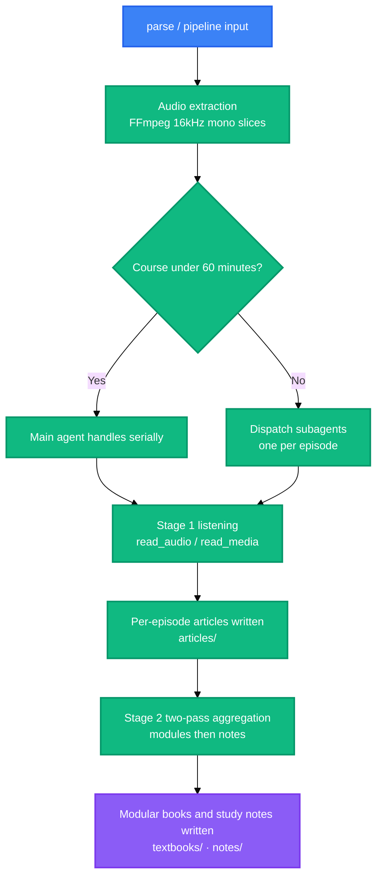

<!-- BEAUTIFIED -->
<h1 align="center">Bili-Video2Book</h1>

<p align="center">
  <strong>Turns long-form Bilibili videos and course series into structured textbook articles, modular chapter books and mindmap study notes.</strong>
  <br />
  <em>Two-stage decoupled pipeline · Dual listening channels · Three deliverable tracks · Pre-delivery quality gate · Zero third-party runtime dependencies</em>
</p>

<p align="center">
  <a href="#quick-start"></a>
  <a href="LICENSE"></a>
</p>

<p align="center">
  
  
  
</p>

<p align="center">
  <a href="https://docs.anthropic.com/en/docs/claude-code"></a>
  <a href="https://openai.com/codex/"></a>
  <a href="https://opencode.ai"></a>
</p>

<p align="center">
  <a href="README.md">中文</a> · English
</p>

---

## Features

| Capability | Description |
| :--- | :--- |
| **Two-stage decoupled pipeline** | Stage 1 produces one article per episode. Stage 2 converges along knowledge boundaries in two passes: modules first, then notes. Plans are authored by the agent, and a missing or out-of-range plan is repaired in place so the command still exits normally. |
| **Dual listening channels** | Hosts with a native audio modality use `read_audio` — no credentials, lower latency. Text-only hosts use `read_media` and let an external model read the audio. Both channels share one pagination contract, so switching means changing only the tool name. |
| **Three deliverable tracks** | Emits per-episode articles (`articles/`), modular chapter books (`textbooks/`) and mindmap study notes (`notes/`), covering deep self-study, systematic reading and exam revision. |
| **Pre-delivery quality gate** | Five fatal patterns stop a deliverable: boilerplate padding, hollow headings, per-episode headings, inline quote fragments and episode voice. The fence language tag is a warning instead, counted only with `--require-lang`. |
| **Zero third-party runtime dependencies** | The toolchain is pure Python 3.8+ standard library. It downloads no model weights and occupies no local GPU memory. The only external dependency is system `ffmpeg`. |
| **Products separated from code** | A three-domain layout keeps the skill, the audio/video MCP servers and the products apart. Products never appear in `git status`, and removing or relocating a repository never touches your deliverables. |

---

## Quick Start

### Prerequisites

- Python 3.8 or later;
- system `ffmpeg` on `PATH`, which is a hard prerequisite for audio extraction and slicing;
- one listening channel: `read_audio` or `read_media`, see the next step;
- a host that supports the Agent Skills specification, such as Claude Code, Codex or OpenCode.

### Install

```bash
# 1) Listening channel: both audio/video MCP servers live in a companion repository
cd .. && git clone https://github.com/LINJIANG12/omni-media.git   # skip if already present in the container layout

cd omni-media/mcp && pip install -e .                     # Channel A: host-native listening, no credentials
python -m omni_media_mcp.cli status                       # diagnose dependencies and per-host mount state
python -m omni_media_mcp.cli apply --target codex         # write this host's MCP config (or opencode/all)

# Channel B: for text-only hosts, fill in config.json first
cd ../mcp-ext && pip install -e .
python -m omni_media_ext.cli config --init                # create config.json, fill in endpoint + api_key
python -m omni_media_ext.cli status --probe               # env + config + endpoint reachability + which one to mount
python -m omni_media_ext.cli apply --target codex

# 2) The skill itself: copy or symlink the single directory skills/bili-video2book/ into your
#    platform's skill directory, or install this repository as a plugin (see references/install.md)
```

### Verify

```bash
cd skills/bili-video2book
python src/cli.py info        # Python / ffmpeg / ffprobe / both listening channels / domain paths
python scripts/selfcheck.py   # full contract self-check, expected to pass
```

### Run

```bash
# --article-type is required; omitting it exits with code 4
bili-video2book pipeline "https://www.bilibili.com/video/BV14VqVBrEhc" --all --article-type learning
```

> Commands are decoupled from the working directory: `--base-dir` defaults to the products root as an
> absolute path, so running from any directory finds the same workspaces.

---

## Usage

The four most common cases follow. All six task-oriented scenarios, including CLI flags and the
wind-down steps, are documented in
[`references/cli-cookbook.md`](skills/bili-video2book/references/cli-cookbook.md).

### Process a whole course

```bash
# A Bilibili course series
bili-video2book pipeline "https://www.bilibili.com/video/BV14VqVBrEhc" --all --article-type learning

# A local course directory
bili-video2book pipeline "D:\courses\software_engineering\" --all --article-type learning
```

### Process selected episodes or a range

```bash
bili-video2book pipeline "https://www.bilibili.com/video/BV14VqVBrEhc" --page 1 --article-type learning
bili-video2book pipeline "https://www.bilibili.com/video/BV14VqVBrEhc" --range 2-5 --article-type learning
```

### Build modular books and study notes

```bash
# After stage 1 per-episode articles are ready, compile the modular book
bili-video2book cluster-articles "https://www.bilibili.com/video/BV14VqVBrEhc"

# Study notes have a single style, so --style is not needed; both planning passes are agent-authored
bili-video2book cluster-notes "https://www.bilibili.com/video/BV14VqVBrEhc"
```

### Quality gate and ledger reconciliation

```bash
python scripts/note_quality_check.py --strict     # note quality inspection
python scripts/render_compat_check.py --strict    # rendering compliance inspection
python src/cli.py sync                            # rewrite manifest.json from on-disk products
```

---

## Architecture



Stage 1 per-episode production and both stage 2 planning passes are agent-authored; the tool layer only
supplies task files, dispatch payloads and gates. Dispatch thresholds live in `src/core/budget.py`: a
course totalling **60 minutes** or less can be handled serially by the main agent, while anything longer
**must** be dispatched to subagents — one per episode, or packed in batches when episodes are short — so a
single context window is never flooded with audio.

The pre-delivery quality gate and ledger reconciliation are separate entry points outside the pipeline,
run by the operator before delivery; see scenario six in
[`references/cli-cookbook.md`](skills/bili-video2book/references/cli-cookbook.md).

---

## Configuration

### Environment Variables

| Variable | Description | Default |
| :--- | :--- | :--- |
| `BVB_HOME` | Container root, the common parent of `skill/`, `omni-media/` and `output/` | Located automatically via the `.bvb-home` marker |
| `BVB_OUTPUT_DIR` | Products root | `<container root>/output` |
| `BVB_AUDIO_TOKENS_PER_SEC` | Audio token coefficient, set it to your host's measured value | `32` |
| `BVB_CONTEXT_WINDOW_TOKENS` | Host context window budget | `1000000` |
| `OMNI_MEDIA_MCP_DIR` | Explicit override for the host-native listening server directory | `<container root>/omni-media/mcp` |
| `BVB_DEBUG` | Set to `1` to re-raise environment errors with a stack trace | unset |

Environment variables must be set before the process starts. `--base-dir <path>` also relocates the
products root for a single run.

### Credentials

Bilibili course tasks accept a `SESSDATA` credential to lower the chance of hitting the 412 rate limit;
local media tasks do not need one. Both configuration methods, the masked fingerprint view and the
security notes are documented in `SKILL.md` §2.

### Runtime State Files

| File | Location | Description |
| :--- | :--- | :--- |
| `.sessdata.json` | Products root | Persisted Bilibili credential, excluded by ignore rules and never committed |
| `.wbi_keys.json` | Products root | WBI signing key cache |
| `.cli_status.json` | Products root | Last 412 and circuit-breaker state |

---

## Project Structure

```text
skill/                                  # this repository: plugin / distribution unit
├── skills/bili-video2book/             # ★ the skill install unit, take this one directory
│   ├── SKILL.md                        # skill definition, the single source of truth
│   ├── references/                     # install matrix, tool mappings, delivery matrix, CLI cookbook
│   ├── scripts/                        # self-check, queue tracking, quality and cleanup entry points
│   └── src/                            # toolchain: CLI, generators, core
├── .codex-plugin/  .claude-plugin/     # platform plugin declarations
├── .agents/plugins/  .opencode/        # generic agents and OpenCode declarations
├── AGENTS.md  CLAUDE.md                # entry files each agent auto-loads
├── README.md  README.en.md
└── pyproject.toml                      # optional: pip install -e . exposes the CLI

<container root>/                        # three-domain layout, this repository is one domain
├── skill/                              # the skill repository, that is this repository
├── omni-media/                         # companion repository: the two audio/video MCP servers
└── output/                             # products root: one workspace per course
```

---

## Tech Stack

### Runtime

| Technology | Purpose |
| :--- | :--- |
| Python 3.8+ | Toolchain implementation, standard library only |
| FFmpeg | Extracts 16 kHz mono speech slices and probes media specifications |

### Protocols and Integration

| Technology | Purpose |
| :--- | :--- |
| MCP | Talks to the listening services (`read_audio` / `read_media`); the pagination contract rides on `OMNI_STATUS` comments |
| Agent Skills specification | Skill distribution and cross-host loading for Claude Code, Codex, OpenCode and others |

---

## Contributing

1. Fork this repository;
2. Create a feature branch: `git checkout -b feature/<name>`;
3. Commit your changes: `git commit -m 'feat: ...'`;
4. Push the branch and open a Pull Request.

Run the self-check from the skill directory before committing — it is the only gate in this repository:

```bash
cd skills/bili-video2book && python scripts/selfcheck.py
```

Changes must respect the hard constraints listed in `CLAUDE.md`: standard library only, Python 3.8
syntax, every subprocess going through `src/core/proc.py` with a hard timeout, skill prose describing
action semantics rather than host-private tool names, and platform differences confined to
`references/host-tools/`.

---

## License

[MIT](LICENSE)
