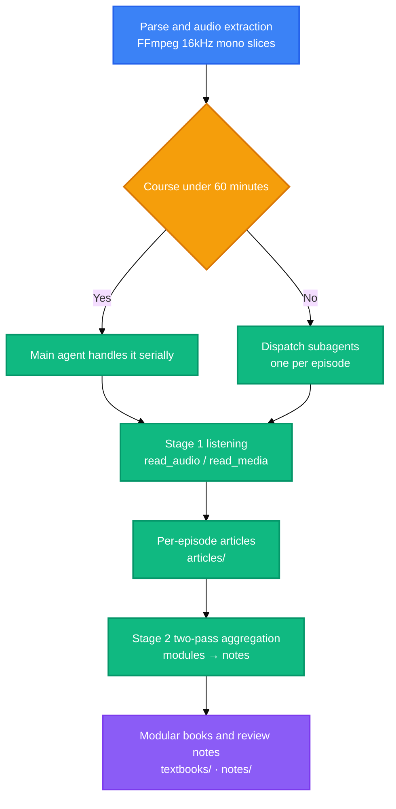

<div align="center">

<a name="readme-top"></a>

<h1>Bili-Video2Book</h1>

<p>
  <strong>Batch-transform Bilibili, YouTube, Douyin videos and local course media into structured textbooks and review notes.</strong>
  <br />
  <em>Two-stage pipeline · Dual listening channels · Three deliverable tracks · Pre-delivery quality gate · Python 3.10+ multi-platform media ingestion engine</em>
</p>

<p>
  <a href="#quick-start"></a>
  <a href="LICENSE"></a>
</p>

<p>
  <a href="https://www.python.org/"></a>
</p>

<p>
  <a href="https://modelcontextprotocol.io/"></a>
  <a href="https://docs.anthropic.com/en/docs/claude-code"></a>
  <a href="https://openai.com/codex/"></a>
  <a href="https://opencode.ai/"></a>
</p>

<p>
  <a href="README.md">简体中文</a> ·
  <strong>English</strong>
</p>

</div>

Give it a course URL or a directory, and it listens episode by episode, writes one article per episode, then consolidates them into books and review notes.

> [!CAUTION]
> This tool batch-fetches Bilibili video metadata and audio streams, and can store your login credential. Use it only on content you are entitled to access, and comply with Bilibili's terms of service and applicable law. `SESSDATA` grants access to your account: do not copy, upload or share it.

## Table of Contents

- [Overview](#overview)
- [Features](#features)
- [Quick Start](#quick-start)
- [How It Works](#how-it-works)
- [Usage](#usage)
- [Requirements](#requirements)
- [Configuration](#configuration)
- [Project Structure](#project-structure)
- [Commands](#commands)
- [Tech Stack](#tech-stack)
- [FAQ](#faq)
- [Security](#security)
- [License](#license)

## Overview

Bili-Video2Book is a skill for AI coding assistants that turns a course into a textbook. It accepts a Bilibili collection or a local course directory, writes one article per episode, and consolidates those articles into a modular book and review notes.

The hard part of a long course is that nobody can listen to all of it and remember it. The usual approach transcribes first, which leaves the reader to turn spoken language into revisable text, and the longer the transcript, the more likely it overflows the agent context. This skill slices the course into audio segments, and a host model with an audio modality listens to each segment and writes the article directly, with no intermediate transcript.

The output comes in three tracks: per-episode articles, modular books and mindmap notes, each in its own directory, usable on its own. Every deliverable passes a quality check before delivery, so problems such as boilerplate padding or hollow headings are stopped there rather than left for you to find while reading.

The only thing you supply is a listening channel, and it comes from the companion repository [omni-media][link-omni-media]: use its `mcp/` when the host model has an audio modality (zero credentials), or its `mcp-ext/` when the host is text-only (an external model reads on your behalf). The channel is a required part of the pipeline; without it stage 1 obtains no audio facts and the run stops to ask you to mount one. After installation, one command runs a whole course.

<div align="right">

[![Back to top][badge-top]](#readme-top)

</div>

## Features

- **One command per course** — Give it a collection URL or a local course directory; it writes one article per episode, then consolidates them into a book and notes
- **Dual listening channels** — Hosts with an audio modality use `read_audio` with zero credentials; text-only hosts use `read_media`. Both channels share one pagination contract
- **Three tracks, separate folders** — Articles land in `articles/`, modular books in `textbooks/`, notes in `notes/`, each usable on its own
- **Pre-delivery quality check** — Boilerplate padding, hollow headings, per-episode headings, inline quote fragments and episode voice fail the check. Fence language tag is a warning, counted only with `--require-lang`
- **Incremental re-runs** — Completed episodes are skipped by default; `--force` reprocesses them
- **No third-party runtime dependencies** — Python standard library only, plus system `ffmpeg`

<div align="right">

[![Back to top][badge-top]](#readme-top)

</div>

## Quick Start

### Prerequisites

```bash
python --version   # 3.8 及以上
ffmpeg -version    # 已加入 PATH
```

### Install

> [!IMPORTANT]
> Step 3 is not optional. Both listening servers come from the companion repository [omni-media][link-omni-media]; pick one. Without a channel, stage 1 obtains no audio facts and the run stops to ask you to mount one.

```bash
# 1) 技能本体：复制这一个目录即可
cp -r skills/bili-video2book ~/.claude/skills/            # Claude Code
cp -r skills/bili-video2book ~/.codex/skills/             # Codex
cp -r skills/bili-video2book ~/.config/opencode/skills/   # OpenCode

# 2) 可选：安装 CLI
pip install -e .

# 3) 听音通道（必需）：两个服务同属配套仓库 omni-media
cd .. && git clone https://github.com/LINJIANG12/omni-media.git

#    通道 A：宿主有原生音频模态（工具列表里有 read_audio），零凭证
cd omni-media/mcp && pip install -e .
omni-media status                    # 诊断系统依赖、各宿主挂载状态与实际配置路径
omni-media apply --target codex      # 挂到宿主；可用取值以 status 的实际输出为准

#    通道 B：宿主只有文本能力（只有 read_media）时改用它
cd ../mcp-ext && pip install -e .
omni-media-ext config --init         # 生成 config.json，填入端点与 api_key
omni-media-ext status
omni-media-ext apply --target codex
```

### Run

```bash
bili-video2book pipeline "https://www.bilibili.com/video/BV14VqVBrEhc" --all --article-type learning
```

Products land under `<products root>/<course workspace>/`: articles in `articles/`, modular books in `textbooks/`, notes in `notes/`.

<div align="right">

[![Back to top][badge-top]](#readme-top)

</div>

## How It Works



- Dispatch thresholds live in `src/core/budget.py`: a course under 60 minutes is handled serially by the main agent, and anything longer is dispatched to subagents, one per episode. When episodes are numerous and short, the tool suggests batching them.
- Stage 1 and stage 2 are decoupled on content boundaries, so a long course can also be resumed after an interruption.
- The tool layer produces task files, dispatch payloads and gates; the agent writes the articles and notes.

<div align="right">

[![Back to top][badge-top]](#readme-top)

</div>

## Usage

### Process a whole course

```bash
# B 站合集
bili-video2book pipeline "https://www.bilibili.com/video/BV14VqVBrEhc" --all --article-type learning

# 本地课程目录
bili-video2book pipeline "D:\courses\software_engineering\" --all --article-type learning
```

### Process selected episodes or a range

```bash
bili-video2book pipeline "https://www.bilibili.com/video/BV14VqVBrEhc" --page 1 --article-type learning
bili-video2book pipeline "https://www.bilibili.com/video/BV14VqVBrEhc" --range 2-5 --article-type learning
```

### Build modular books and review notes

```bash
bili-video2book cluster-articles "https://www.bilibili.com/video/BV14VqVBrEhc"
bili-video2book cluster-notes "https://www.bilibili.com/video/BV14VqVBrEhc"
```

### Quality check and ledger reconciliation

```bash
python scripts/note_quality_check.py --strict      # 笔记成色
python scripts/render_compat_check.py --strict     # 渲染合规
bili-video2book sync                               # 以磁盘产物回填 manifest.json
```

<div align="right">

[![Back to top][badge-top]](#readme-top)

</div>

## Requirements

- **Python** — 3.8 or later, from `requires-python` in `pyproject.toml`
- **External binary** — `ffmpeg`, on `PATH`
- **Listening channel** — one of `read_audio` or `read_media`, supplied by the companion repository [omni-media][link-omni-media]
- **Operating system** — OS independent, per the classifiers in `pyproject.toml`

<div align="right">

[![Back to top][badge-top]](#readme-top)

</div>

## Configuration

### Environment variables

| Variable | Description | Default | Required |
|---|---|---|---|
| `BVB_HOME` | Container root, the common parent of `skill/`, `omni-media/` and `output/` | located via the `.bvb-home` marker | no |
| `BVB_OUTPUT_DIR` | Products root | `<container root>/output` | no |
| `BVB_AUDIO_TOKENS_PER_SEC` | Audio token coefficient; set `100` for OpenAI pricing | `32` | no |
| `BVB_CONTEXT_WINDOW_TOKENS` | Context window budget | `1000000` | no |
| `OMNI_MEDIA_MCP_DIR` | Override for the host-native listening server directory | `<container root>/omni-media/mcp` | no |
| `BVB_DEBUG` | Set to `1` to re-raise errors with a stack trace | unset | no |

Set environment variables before the process starts. A single run can relocate the products root with `--base-dir <path>`; command-line flags take precedence over environment variables.

<div align="right">

[![Back to top][badge-top]](#readme-top)

</div>

## Project Structure

```
bili-video2book/
├── skills/bili-video2book/     # 技能本体，安装时只需这一个目录
│   ├── SKILL.md                # 技能契约，Agent 的唯一事实源
│   ├── src/                    # 工具链
│   │   ├── cli.py              # 入口：12 个子命令
│   │   ├── core/               # 路径、音频预算、流水线、抓取、交付物质检
│   │   └── generator/          # 任务书、提示词模板与语义聚合
│   ├── scripts/                # 质检、清理、队列跟踪与全量自检
│   └── references/             # 安装说明、交付矩阵、命令速查、工具映射
├── agents/                     # 通用 agents 侧的技能元数据
├── .claude-plugin/             # Claude Code 插件清单
├── .codex-plugin/              # Codex 插件清单
├── .opencode/                  # OpenCode 安装说明
└── pyproject.toml              # 包元数据与 CLI 入口
```

<div align="right">

[![Back to top][badge-top]](#readme-top)

</div>

## Commands

| Command | Description | Example |
|---|---|---|
| `parse` | Parse video topology and list episodes | `bili-video2book parse "<url>" --limit 10` |
| `audio` | Download or extract the audio stream | `bili-video2book audio "<url>" --all` |
| `transcribe` | Export a per-episode article task file, with no intermediate transcript | `bili-video2book transcribe "<url>" --page 1 --article-type learning` |
| `pipeline` | Run the complete pipeline | `bili-video2book pipeline "<url>" --all --article-type learning` |
| `cluster-articles` | Consolidate per-episode articles into modular books | `bili-video2book cluster-articles "<url>"` |
| `cluster-notes` | Two-pass semantic aggregation, exports note task files | `bili-video2book cluster-notes "<url>"` |
| `dedup` | Synchronize duplicate audio assets to save tokens | `bili-video2book dedup --dry-run` |
| `cleanup` | Reclaim completed task files, keeping samples per category | `bili-video2book cleanup --dry-run` |
| `sync` | Reconcile `manifest.json` against on-disk products | `bili-video2book sync --dry-run` |
| `info` | Show environment and toolchain readiness | `bili-video2book info` |
| `login` | Persist a Bilibili SESSDATA cookie | `bili-video2book login --sessdata "<SESSDATA>"` |
| `logout` | Remove the persisted SESSDATA cookie | `bili-video2book logout` |

### Global flags

| Flag | Description | Default |
|---|---|---|
| `--base-dir` | Products root path | `BVB_OUTPUT_DIR` or `<container root>/output` |
| `--task` | Name of the course workspace directory | the most recently active one |
| `--sessdata` | Credential for this run, taking precedence over the saved copy | the saved copy |
| `--json` | Emit JSON, `parse` and `audio` only | off |

### Exit codes

- `0` — finished normally
- `4` — article prompt style not confirmed, that is `--article-type` is missing or invalid

<div align="right">

[![Back to top][badge-top]](#readme-top)

</div>

## Tech Stack

### Runtime

- **Python 3.8 or later** — the only runtime, standard library only
- **setuptools** — build backend, see `pyproject.toml`

### External dependencies

- **FFmpeg** — audio extraction and slicing, 16kHz mono

### Optional channels

- **MCP** — the protocol behind the host-native listening channel

<div align="right">

[![Back to top][badge-top]](#readme-top)

</div>

## FAQ

### Can I use this without omni-media

No. Both listening channels, `read_audio` and `read_media`, come from [omni-media][link-omni-media], and the pipeline lists them as required: when stage 1 obtains no audio facts, the run stops and asks you to mount one.

### Should I install mcp or mcp-ext

It depends on the host modality. If your tool list contains `read_audio`, the host has an audio modality: install `mcp/`, which has the lowest latency and needs no credential. If you only have `read_media`, the host is text-only: install `mcp-ext/`, whose `config.json` points at an external model endpoint. The two channels share one paging contract, so switching means changing the tool name.

### How do I confirm the mount worked

`bili-video2book info` prints the readiness of both channels along with the domain paths; `omni-media status` diagnoses system dependencies, the mount state of each host and the actual config path.

### Will my credentials reach version control

No. This repository excludes the Bilibili `SESSDATA`, and omni-media excludes `mcp-ext` `config.json`, committing only the template. Channel A needs no credential at all.

<div align="right">

[![Back to top][badge-top]](#readme-top)

</div>

## Security

- Credential storage: `login` writes the Bilibili `SESSDATA` cookie as plain text under the products root. Ignore rules exclude the file, so it never enters version control.
- Invalidation: if you suspect a leak, sign out of Bilibili to invalidate the credential, then run `logout` to clear the local copy.
- Access scope: the tool reads public Bilibili video metadata and audio streams, plus the local media files you point it at.
- Reporting: this repository has no `SECURITY.md` yet. Open an issue for security concerns.

<div align="right">

[![Back to top][badge-top]](#readme-top)

</div>

## License

[MIT](LICENSE)

<div align="right">

[![Back to top][badge-top]](#readme-top)

</div>

<!-- LINKS & IMAGES -->

[badge-top]: https://img.shields.io/badge/-BACK_TO_TOP-151515?style=flat-square
[badge-python]: https://img.shields.io/badge/Python_3.8%2B-3776AB?style=flat&logo=python&logoColor=white
[badge-mcp]: https://img.shields.io/badge/MCP-3178C6?style=flat
[badge-claude]: https://img.shields.io/badge/Claude_Code-D97757?style=flat&logo=claude&logoColor=white
[badge-codex]: https://img.shields.io/badge/Codex-000000?style=flat&logo=openai&logoColor=white
[badge-opencode]: https://img.shields.io/badge/OpenCode-3178C6?style=flat
[link-python]: https://www.python.org/
[link-mcp]: https://modelcontextprotocol.io/
[link-claude]: https://docs.anthropic.com/en/docs/claude-code
[link-codex]: https://openai.com/codex/
[link-opencode]: https://opencode.ai/
[link-license]: LICENSE
[link-omni-media]: https://github.com/LINJIANG12/omni-media
