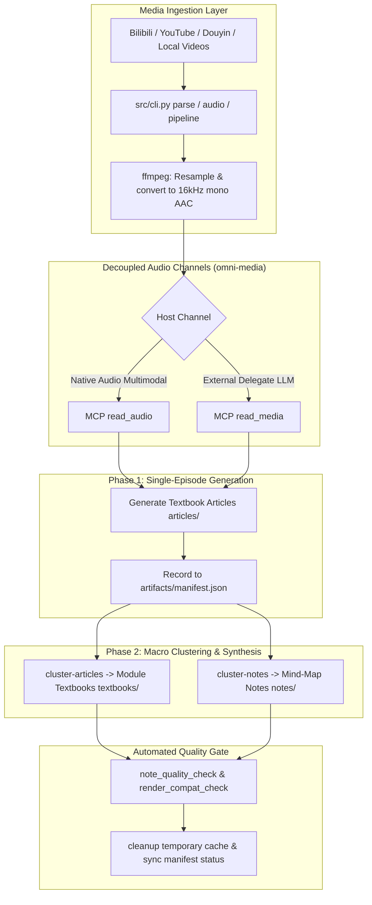

<div align="center">

# bili-video2book

Cross-Platform Long-Video/Online Course Refactoring Engine & Agent Skill
<br />
Zero Intermediate ASR · 16kHz Audio Direct-to-Textbook · Clustered Textbooks & Mind Maps · Native & External Audio Channels

<p>
  <a href="LICENSE"></a>
  
  
  
</p>

<p>
  <a href="README.md">简体中文</a> •
  <a href="README.en.md"><b>English</b></a>
</p>

</div>

---

## Table of Contents

- [Overview](#overview)
- [Three Delivery Tracks](#three-delivery-tracks)
- [Key Features](#key-features)
- [Architecture & How It Works](#architecture--how-it-works)
- [Quick Start](#quick-start)
- [Platform Installation Guide](#platform-installation-guide)
- [Common Scenarios](#common-scenarios)
- [CLI Command Reference](#cli-command-reference)
- [Requirements & Dependencies](#requirements--dependencies)
- [Environment Variables & Configuration](#environment-variables--configuration)
- [Project Structure](#project-structure)
- [Quality Assurance & Validation](#quality-assurance--validation)
- [Troubleshooting & FAQ](#troubleshooting--faq)
- [Security & Usage Boundaries](#security--usage-boundaries)
- [License](#license)

---

## Overview

Most video summarization tools generate shallow bullet points, flat transcripts, or bloated paragraphs, stripping away blackboard step-by-step derivations, authentic tone, technical context, and pedagogical transitions.

`bili-video2book` is a cross-platform AI Agent Skill and media ingestion engine:
- **Multi-Source Ingestion**: Natively ingests Bilibili, YouTube, Douyin, and local video folders without tedious configuration.
- **Zero Intermediate Transcription**: Completely bypasses raw ASR text, routing audio directly through Model Context Protocol (MCP) audio listening channels (`read_audio` for native multimodal LLMs, or `read_media` for external model delegate reading).
- **Three Structured Deliverables**: Converts speech and video into **deep-dive single-episode textbook articles**, **clustered module textbooks**, and **mind-map review notes**.

---

## Three Delivery Tracks

All deliverables are generated inside the output root (default `<workspace_root>/output/<task>/`), completely decoupled from the skill source code.

| Deliverable Track | Storage Path | Primary Use Case | Core Standards & Typography |
| :--- | :--- | :--- | :--- |
| **Single-Episode Textbook Articles** | `output/<task>/articles/` | Targeted study, micro-level mathematical derivation, self-guided learning | Preserves complete formulas, derivations, and blackboard notes. Supports `learning` (modern study guide, recommended) and `legacy` (objective academic lecture). Zero filler paragraphs. |
| **Clustered Module Textbooks** | `output/<task>/textbooks/` | Systemic reading, cross-chapter continuity, offline printing | Synthesizes multiple episodes into chapters with introductions, section transitions, unified terminology, and technical summaries. |
| **Mind-Map Review Notes** | `output/<task>/notes/` | Exam preparation, knowledge indexing, Markmap / XMind import | Two-pass clustering providing high-density structured notes, ASCII knowledge topology trees, and concept comparison matrices. |

---

## Key Features

- **Unified Ingestion Engine**: Automatically handles Bilibili (episodes, series, favorites), YouTube, Douyin, and local directories, standardizing streams into 16kHz mono AAC audio.
- **Dual Audio Channel Protocol**: Integrates with companion [`omni-media`](https://github.com/LINJIANG12/omni-media) MCP services:
  - `read_audio`: For LLMs with native audio understanding;
  - `read_media`: For host environments delegating listening to dedicated external models.
- **Two-Phase Pipeline Orchestration**:
  - Phase 1 (Micro): Concurrent audio extraction, task manifest creation, and single-episode article generation;
  - Phase 2 (Macro): Semantic chapter clustering, full textbook compilation, and note synthesis.
- **Three-Tier Quality Gate**: Automated verification via `note_quality_check` (information density), `render_compat_check` (Typora Markdown compliance), and `cleanup` / `sync` (artifact verification).
- **Native Agent Standard**: Strictly adheres to the Agent Skills specification. Code, media, and artifacts are strictly isolated across three distinct directories.

---

## Architecture & How It Works

The architecture enforces strict **three-domain isolation**:
- **Code Domain (`skill/`)**: Agent skill definitions, CLI utilities, and quality scripts.
- **Media Domain (`omni-media/`)**: MCP listening server channels (`read_audio` / `read_media`).
- **Artifact Domain (`output/`)**: Audio segments, manifests, articles, textbooks, and notes.



---

## Quick Start

### 1. Verify Environment

Run diagnostic check inside the skill folder to verify Python, ffmpeg, and MCP channels:

```bash
python skills/bili-video2book/src/cli.py info
```

Ensure Python 3.10+, ffmpeg, and at least one audio listening channel are available.

### 2. Step-by-Step Workflow

Process a video or course episode step-by-step:

```bash
# Step 1: Parse metadata
python skills/bili-video2book/src/cli.py parse "https://www.bilibili.com/video/BV1xx411c7mD" --base-dir ./output

# Step 2: Extract & convert 16kHz audio
python skills/bili-video2book/src/cli.py audio BV1xx411c7mD --base-dir ./output

# Step 3: Create transcription task manifest (explicit --article-type learning required)
python skills/bili-video2book/src/cli.py transcribe BV1xx411c7mD --article-type learning --base-dir ./output
```

> **Note**: After creating `ARTICLE_TASK.md`, the host Agent will read the task manifest and invoke the MCP audio tool to write the article.

### 3. One-Click Pipeline (Batch Processing)

Automate Phase 1 preparation in a single command:

```bash
python skills/bili-video2book/src/cli.py pipeline "https://www.bilibili.com/video/BV1xx411c7mD" --article-type learning --base-dir ./output
```

---

## Platform Installation Guide

> ⚠️ **Installation Boundary**: The **installable unit is strictly the `skills/bili-video2book/` directory**. Other repository files (`README.md`, `LICENSE`, `pyproject.toml`, etc.) are repository metadata and should NOT be installed. Do NOT copy `SKILL.md` alone, as its toolchain lives in the same folder.

### Platform Matrix

| Platform | User-Level Directory | Project-Level Directory | Installation Method |
| :--- | :--- | :--- | :--- |
| **Claude Code** | `~/.claude/skills/bili-video2book/` | `<project>/.claude/skills/bili-video2book/` | Symlink or copy `skills/bili-video2book/`. Automatically detected as a plugin. |
| **Codex** | `~/.codex/skills/bili-video2book/` | `<project>/.codex/skills/bili-video2book/` | Plugin manifest ready at `.codex-plugin/plugin.json`; or symlink directly. |
| **OpenCode** | `~/.config/opencode/skills/bili-video2book/` | `<project>/.opencode/skills/bili-video2book/` | Symlink or copy `skills/bili-video2book/` into OpenCode skill folder. |
| **Generic Agents**| `~/.agents/skills/bili-video2book/` | `<project>/.agents/skills/bili-video2book/` | Compatible with Agent Skills specification; declared in `.agents/plugins/marketplace.json`. |

### Manual Installation (Unlisted Platforms)

1. **Native Plugin Registration**: Provide repository URL if the host supports Git plugin installations.
2. **Directory Symlink / Junction (Recommended)**:
   - **Linux / macOS**: `ln -s <repo>/skills/bili-video2book <host_skill_dir>/bili-video2book`
   - **Windows**: `mklink /J "<host_skill_dir>\bili-video2book" "<repo>\skills\bili-video2book"`
3. **Full Directory Copy**: Copy `skills/bili-video2book/` directly into the platform skill directory.

---

## Common Scenarios

### Scenario 1: University Courses & Technical Lectures

Ideal for multi-part academic series, computer science lectures, and technical tutorials:
```bash
python skills/bili-video2book/src/cli.py pipeline "https://www.bilibili.com/video/BV1xx411c7mD" --article-type learning --base-dir ./output
```

### Scenario 2: Local Video Folders & Screen Recordings

Process offline meetings, enterprise training videos, and recorded workshops:
```bash
# Parse local directory
python skills/bili-video2book/src/cli.py parse "D:/courses/cs61a" --base-dir ./output

# Extract audio & prepare task manifests
python skills/bili-video2book/src/cli.py audio cs61a --base-dir ./output
python skills/bili-video2book/src/cli.py transcribe cs61a --article-type learning --base-dir ./output
```

### Scenario 3: Synthesizing Full Clustered Textbooks

After generating single-episode articles, execute Phase 2 textbook synthesis:
```bash
python skills/bili-video2book/src/cli.py cluster-articles <task_id> --base-dir ./output
```
Synthesizes episodes into chapters while preserving all original files in `articles/`.

### Scenario 4: Generating Mind-Map Review Notes

Extract knowledge topology and generate review notes with ASCII trees:
```bash
python skills/bili-video2book/src/cli.py cluster-notes <task_id> --base-dir ./output
```

### Scenario 5: Bilibili Authentication Persistence

Acquire premium or high-bitrate audio streams:
```bash
python skills/bili-video2book/src/cli.py login
```
Prompts for SESSDATA and stores it obfuscated locally. If omitted, downloads automatically fall back to 480P audio tracks.

---

## CLI Command Reference

All commands run via `python skills/bili-video2book/src/cli.py <subcommand>`:

| Subcommand | Syntax & Arguments | Description | Primary Output / Exit Code |
| :--- | :--- | :--- | :--- |
| `parse` | `parse <source> [--base-dir DIR]` | Parses video metadata or local directory | `manifest.json` |
| `audio` | `audio <task_id> [--p N] [--base-dir DIR]` | Extracts & converts 16kHz AAC audio | `audio/*.m4a`, `audio_index.json` |
| `transcribe` | `transcribe <task_id> --article-type <type> [--p N]` | Validates prompt type & creates task | `ARTICLE_TASK.md`; invalid type exits with code `4` |
| `pipeline` | `pipeline <source> --article-type <type> [--base-dir DIR]` | Chains Phase 1 preparation steps | Executes `parse` + `audio` + `transcribe` |
| `cluster-notes` | `cluster-notes <task_id> [--base-dir DIR]` | Clusters concepts into review notes | Output in `notes/` with ASCII tree |
| `cluster-articles`| `cluster-articles <task_id> [--base-dir DIR]` | Compiles episodes into textbooks | Output in `textbooks/` |
| `dedup` | `dedup <task_id> [--base-dir DIR]` | Cleans up duplicate draft copies | Eliminates redundant intermediate files |
| `cleanup` | `cleanup <task_id> [--all] [--base-dir DIR]` | Cleans large audio files & caches | Removes media cache, retains documents |
| `sync` | `sync <task_id> [--base-dir DIR]` | Audits artifacts & updates manifest | Updates `manifest.json` status |
| `login` | `login` | Validates & persists Bilibili credentials | Obfuscated local storage |
| `logout` | `logout` | Clears stored credentials | Removes local session cache |
| `info` | `info` | Prints environment and channel diagnostics | System status summary; exits with `0` |

---

## Requirements & Dependencies

### 1. System Prerequisites
- **Python 3.10+**
- **ffmpeg & ffprobe**: Must be available in system `PATH` for audio resampling and segmentation.

### 2. Python Packages
```bash
pip install yt-dlp requests
```

### 3. Audio Channels
Requires companion repository [`LINJIANG12/omni-media`](https://github.com/LINJIANG12/omni-media):
- Native Multimodal MCP: `<workspace_root>/omni-media/mcp/` (provides `read_audio`);
- External Delegate MCP: `<workspace_root>/omni-media/mcp-ext/` (provides `read_media`).

---

## Environment Variables & Configuration

| Variable | Description | Default Value |
| :--- | :--- | :--- |
| `BVB_OUTPUT_DIR` | Absolute output directory for artifacts | `<workspace_root>/output/` |
| `BVB_HOME` | Working home directory of the skill | Auto-detected from script path |
| `BVB_SESSDATA` / `SESSDATA` | Bilibili session credential for premium audio | Empty (falls back to 480P audio) |

> **Note**: The `--base-dir <path>` argument can be passed to any CLI command and takes precedence over `BVB_OUTPUT_DIR`.

---

## Project Structure

```
skill/
├── AGENTS.md                          # Cross-platform Agent entrypoint
├── CLAUDE.md                          # Claude development guidelines
├── LICENSE                            # MIT License
├── pyproject.toml                     # Project packaging & dependencies
├── README.md                          # Chinese documentation
├── README.en.md                       # English documentation (this file)
└── skills/
    └── bili-video2book/               # [Core Installable Unit] Skill root
        ├── SKILL.md                   # Single source of truth for Agent skill
        ├── references/                # Technical guides & references
        │   ├── cli-cookbook.md        # CLI cookbook for 6 practical scenarios
        │   ├── delivery_matrix.md     # Standards for deliverables & typography
        │   ├── install.md             # Detailed platform installation paths
        │   └── host-tools/            # Host Agent tool mapping tables
        ├── scripts/                   # Verification and maintenance scripts
        │   ├── selfcheck.py           # Single-gate selfcheck script
        │   ├── note_quality_check.py  # Note quality and density check
        │   ├── render_compat_check.py # Typora rendering compatibility check
        │   └── cleanup_tasks.py       # Task cleanup maintenance
        └── src/                       # Media ingestion & pipeline toolchain
            ├── cli.py                 # Unified CLI entrypoint
            └── core/                  # Engine orchestration & downloaders
```

---

## Quality Assurance & Validation

Run quality checks before finalizing any deliverable:

```bash
# 1. Check note quality & information density
python skills/bili-video2book/scripts/note_quality_check.py output/<task_id>/notes/

# 2. Check Typora Markdown rendering compatibility
python skills/bili-video2book/scripts/render_compat_check.py output/<task_id>/

# 3. Complete environment and skill selfcheck
python skills/bili-video2book/scripts/selfcheck.py
```

### Typora Rendering Recommendation
Deliverables are optimized for **Typora**:
- Inline Math: In Typora, navigate to **Preferences** → **Markdown** → enable **Inline Math** (`$...$`) to ensure mathematical formulas render properly.

---

## Troubleshooting & FAQ

### Q1: Garbled characters or UnicodeEncodeError on Windows?
All CLI entrypoints invoke `enable_utf8_console()` to enforce UTF-8 streams. Ensure your terminal (Windows Terminal, PowerShell) uses a font supporting CJK characters.

### Q2: `transcribe` or `pipeline` fails with exit code 4?
Article writing requires strict stylistic grounding. The engine provides mature prompts for `learning` (modern study guide, recommended) and `legacy` (academic textbook). Passing an invalid or experimental type (such as `interview` or `consulting`) aborts execution with code `4`. Explicitly pass `--article-type learning`.

### Q3: Bilibili audio download returns 403 Forbidden?
Certain videos require user authentication. Run `python skills/bili-video2book/src/cli.py login` to store your SESSDATA. Without credentials, the system automatically falls back to 480P audio streams.

---

## Security & Usage Boundaries

1. **Credential Privacy**: SESSDATA is stored in an obfuscated local file and is never uploaded to external servers.
2. **Copyright Disclaimer**: This tool is designed strictly for personal study, technical synthesis, and academic review. Respect original copyright holders. Do not use generated content for unauthorized commercial redistribution.
3. **Tool Invariance**: Skill instructions use generic behavioral semantics ("read file", "write file") rather than hardcoded host tool names. Host tool mappings are isolated in `references/host-tools/`.

---

## License

This project is licensed under the [MIT License](LICENSE).
