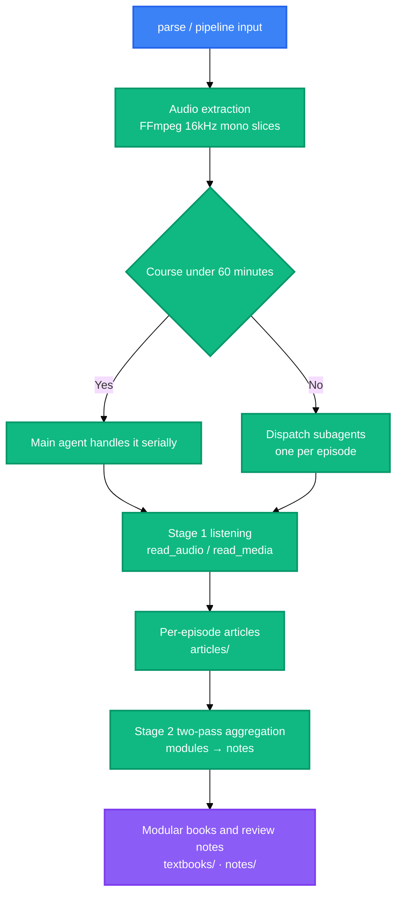

<div align="center">

<a name="readme-top"></a>

<h1>Bili-Video2Book</h1>

<p>
  <strong>Batch-transform Bilibili videos and local course media into structured textbooks and review notes.</strong>
  <br />
  <em>Two-stage pipeline · Dual listening channels · Three deliverable tracks · Pre-delivery quality gate · Python 3.8+ standard library only</em>
</p>

<p>
  <a href="#installation"></a>
  <a href="LICENSE"></a>
</p>

<p>
  <a href="https://www.python.org/"></a>
</p>

<p>
  <a href="https://modelcontextprotocol.io/"></a>
  <a href="https://docs.anthropic.com/en/docs/claude-code"></a>
  <a href="https://openai.com/codex/"></a>
  <a href="https://opencode.ai/"></a>
</p>

<p>
  <a href="README.md">简体中文</a> ·
  <strong>English</strong>
</p>

</div>

> [!CAUTION]
> A persisted Bilibili `SESSDATA` cookie grants access to your account and is stored as plain text under the products root. Ignore rules exclude the file, so it never enters version control. Do not copy, upload or share it. If you suspect a leak, sign out of Bilibili to invalidate it, then run `logout` to clear the local copy.

## Features

- Two-stage pipeline: stage 1 writes one textbook article per episode, stage 2 converges along knowledge boundaries into modular books and review notes
- Dual listening channels: `read_audio` when the host has an audio modality, `read_media` for text-only hosts; both share one pagination contract
- Three deliverable tracks: per-episode articles in `articles/`, modular books in `textbooks/`, mindmap notes in `notes/`
- Pre-delivery quality gate stops five fatal patterns: boilerplate padding, hollow headings, per-episode headings, inline quote fragments and episode voice
- Fence language tag is a warning, counted only with `--require-lang`
- Zero third-party runtime dependencies: Python 3.8 or later, standard library only, plus system `ffmpeg`

## Installation

### Prerequisites

- Python 3.8 or later
- system `ffmpeg` on `PATH`
- one listening channel: `read_audio` or `read_media`

### Install the skill and the listening channel

```bash
# 技能本体：复制这一个目录即可，也可直接作为插件安装
cp -r skills/bili-video2book ~/.claude/skills/            # Claude Code
cp -r skills/bili-video2book ~/.codex/skills/             # Codex
cp -r skills/bili-video2book ~/.config/opencode/skills/   # OpenCode

# 可选：安装 CLI
pip install -e .

# 听音通道：两个音视频 MCP 服务同属配套仓库 omni-media
cd .. && git clone https://github.com/LINJIANG12/omni-media.git
cd omni-media/mcp && pip install -e .                     # 通道 A：宿主原生听音，零凭证
python -m omni_media_mcp.cli status                       # 诊断依赖与各宿主挂载状态
python -m omni_media_mcp.cli apply --target codex         # 写入该宿主的 MCP 配置（或用 opencode/all）

# 通道 B：宿主只有文本能力时改用它，需先填 config.json
cd ../mcp-ext && pip install -e .
python -m omni_media_ext.cli config --init
python -m omni_media_ext.cli apply --target codex
```

### Environment variables

| Variable | Description | Default | Required |
|---|---|---|---|
| `BVB_HOME` | Container root, the common parent of `skill/`, `omni-media/` and `output/` | located via the `.bvb-home` marker | no |
| `BVB_OUTPUT_DIR` | Products root | `<container root>/output` | no |
| `BVB_AUDIO_TOKENS_PER_SEC` | Audio token coefficient; set `100` for OpenAI pricing | `32` | no |
| `BVB_CONTEXT_WINDOW_TOKENS` | Context window budget | `1000000` | no |
| `OMNI_MEDIA_MCP_DIR` | Override for the host-native listening server directory | `<container root>/omni-media/mcp` | no |
| `BVB_DEBUG` | Set to `1` to re-raise errors with a stack trace | unset | no |

Set environment variables before the process starts. A single run can relocate the products root with `--base-dir <path>`.

### Verify

```bash
cd skills/bili-video2book
python src/cli.py info        # 打印 Python、ffmpeg、ffprobe、两条听音通道与域路径
python scripts/selfcheck.py   # 全量契约自检，退出码 0 表示全部通过
```

## Usage

### Process a whole course

```bash
# B 站合集
bili-video2book pipeline "https://www.bilibili.com/video/BV14VqVBrEhc" --all --article-type learning

# 本地课程目录
bili-video2book pipeline "D:\courses\software_engineering\" --all --article-type learning
```

### Process selected episodes or a range

```bash
bili-video2book pipeline "https://www.bilibili.com/video/BV14VqVBrEhc" --page 1 --article-type learning
bili-video2book pipeline "https://www.bilibili.com/video/BV14VqVBrEhc" --range 2-5 --article-type learning
```

### Build modular books and review notes

```bash
bili-video2book cluster-articles "https://www.bilibili.com/video/BV14VqVBrEhc"
bili-video2book cluster-notes "https://www.bilibili.com/video/BV14VqVBrEhc"
```

### Quality gate and ledger reconciliation

```bash
python scripts/note_quality_check.py --strict      # 笔记成色
python scripts/render_compat_check.py --strict     # 渲染合规
bili-video2book sync                               # 以磁盘产物回填 manifest.json
```

## Commands

| Command | Description | Example |
|---|---|---|
| `parse` | Parse video topology and list episodes | `bili-video2book parse "<url>" --limit 10` |
| `audio` | Download or extract the audio stream | `bili-video2book audio "<url>" --all` |
| `transcribe` | Export a per-episode article task file, with no intermediate transcript | `bili-video2book transcribe "<url>" --page 1 --article-type learning` |
| `pipeline` | Run the complete pipeline | `bili-video2book pipeline "<url>" --all --article-type learning` |
| `cluster-articles` | Consolidate per-episode articles into modular books | `bili-video2book cluster-articles "<url>"` |
| `cluster-notes` | Two-pass semantic aggregation, exports note task files | `bili-video2book cluster-notes "<url>"` |
| `dedup` | Synchronize duplicate audio assets to save tokens | `bili-video2book dedup --dry-run` |
| `cleanup` | Reclaim completed task files, keeping samples per category | `bili-video2book cleanup --dry-run` |
| `sync` | Reconcile `manifest.json` against on-disk products | `bili-video2book sync --dry-run` |
| `info` | Show environment and toolchain readiness | `bili-video2book info` |
| `login` | Persist a Bilibili SESSDATA cookie | `bili-video2book login --sessdata "<SESSDATA>"` |
| `logout` | Remove the persisted SESSDATA cookie | `bili-video2book logout` |

### Global flags

| Flag | Description | Default |
|---|---|---|
| `--base-dir` | Products root path | `BVB_OUTPUT_DIR` or `<container root>/output` |
| `--task` | Name of the course workspace directory | the most recently active one |
| `--sessdata` | Credential for this run, taking precedence over the saved copy | the saved copy |
| `--json` | Emit JSON, `parse` and `audio` only | off |

### Exit codes

| Code | Meaning |
|---|---|
| `0` | Finished normally |
| `4` | Article prompt style not confirmed, that is `--article-type` is missing or invalid |

## Workflow



Dispatch thresholds live in `src/core/budget.py`: a course under 60 minutes is handled serially by the main agent, and anything longer is dispatched to subagents, one per episode. When episodes are numerous and short, the tool suggests batching them. Stage 1 per-episode writing and both stage 2 planning passes are agent-authored; the tool layer supplies task files, dispatch payloads and gates.

## License

[MIT](LICENSE)

<div align="right">

[![Back to top][badge-top]](#readme-top)

</div>

<!-- LINKS & IMAGES -->

[badge-top]: https://img.shields.io/badge/-BACK_TO_TOP-151515?style=flat-square

[badge-python]: https://img.shields.io/badge/Python_3.8%2B-3776AB?style=flat&logo=python&logoColor=white
[badge-mcp]: https://img.shields.io/badge/MCP-111827?style=flat
[badge-claude]: https://img.shields.io/badge/Claude_Code-D97757?style=flat&logo=claude&logoColor=white
[badge-codex]: https://img.shields.io/badge/Codex-000000?style=flat&logo=openai&logoColor=white
[badge-opencode]: https://img.shields.io/badge/OpenCode-4B5563?style=flat
[badge-cta-install]: https://img.shields.io/badge/Install-4CAF50?style=for-the-badge
[badge-cta-license]: https://img.shields.io/badge/License-MIT-yellow?style=for-the-badge
[link-python]: https://www.python.org/
[link-mcp]: https://modelcontextprotocol.io/
[link-claude]: https://docs.anthropic.com/en/docs/claude-code
[link-codex]: https://openai.com/codex/
[link-opencode]: https://opencode.ai/
[link-license]: LICENSE
[link-omni-media]: https://github.com/LINJIANG12/omni-media
