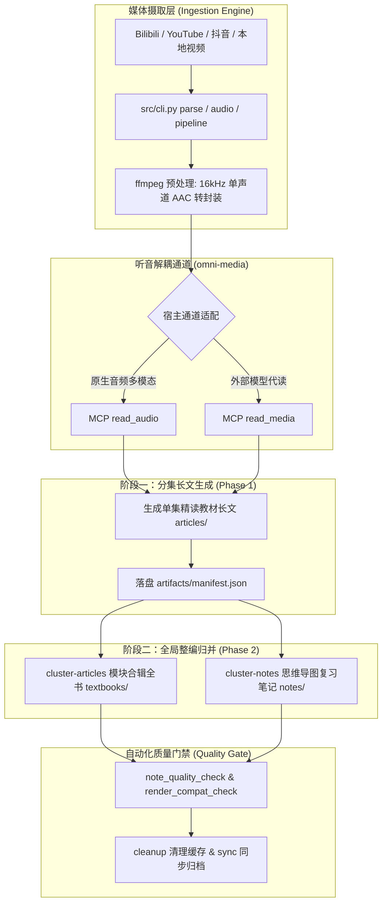

<div align="center">

# bili-video2book

跨平台网课/长视频/音视频重构引擎与 Agent 技能
<br />
零中间纯文本转录 · 16kHz 音频直达教材长文 · 模块全书与脑图笔记 · 原生与外部听音双通道

<p>
  <a href="LICENSE"></a>
  
  
  
</p>

<p>
  <a href="README.md"><b>简体中文</b></a> •
  <a href="README.en.md">English</a>
</p>

</div>

---

## 目录

- [项目概述](#项目概述)
- [三大交付轨道](#三大交付轨道)
- [核心特性](#核心特性)
- [工作原理与架构流程](#工作原理与架构流程)
- [快速上手](#快速上手)
- [各平台安装指南](#各平台安装指南)
- [典型使用场景](#典型使用场景)
- [CLI 命令完整速查](#cli-命令完整速查)
- [前置要求与依赖](#前置要求与依赖)
- [环境变量与配置](#环境变量与配置)
- [项目结构](#项目结构)
- [质检体系与准出规范](#质检体系与准出规范)
- [常见问题与故障排查](#常见问题与故障排查)
- [安全与使用边界](#安全与使用边界)
- [开源许可证](#开源许可证)

---

## 项目概述

市面上大部分长视频总结工具通常生成扁平的纯文本速记、浅层摘要或注水段落，丢失了板书推导、推演细节、口吻语感与体系化的前后过渡。

`bili-video2book` 是一套跨 AI Agent 平台的专业技能（Agent Skill）与统一媒体摄取引擎：
- **多源摄取**：原生支持 Bilibili、YouTube、抖音及本地多媒体音视频，零配置统一提取转封装；
- **零中间纯文本转录**：跳过低精度的 ASR 文本中转，直接调度模型听音通道（`read_audio` 原生音频多模态或 `read_media` 外部模型代读）；
- **三轨专业交付**：将碎片化口语讲义重构为**单集精读教材长文**、**模块合辑全书**与**思维导图复习笔记**。

---

## 三大交付轨道

所有产物默认生成在产物根目录（默认 `<容器根>/output/<task>/`），严格与代码域保持三域隔离。

| 交付产物 | 存储路径 | 适用场景 | 核心特征与排版标准 |
| :--- | :--- | :--- | :--- |
| **单集精读教材长文** | `output/<task>/articles/` | 单集定向研读、微粒度推导理解、自学跟学 | 完整还原推导演算与真实板书；支持 `learning` 现代学习指南（推荐）与 `legacy` 经典逐字讲义两种风格，杜绝注水段落 |
| **模块合辑全书** | `output/<task>/textbooks/` | 体系化通读、跨章节演进串联、打印装订 | 跨分集章节聚类整编，补充导读与小节过渡，消除单集割裂感，统一全书术语与模块技术总结 |
| **思维导图复习笔记** | `output/<task>/notes/` | 考前复习、知识盘点、Markmap/XMind 导入 | 两趟规划（模块划分与笔记归并），提供高信息密度条目、ASCII 知识拓扑树与概念图谱 |

---

## 核心特性

- **多平台统一摄取引擎**：统一抽象 B 站（分 P/列表/收藏夹）、YouTube、抖音及本地视频目录，自动提取并转封装为 16kHz 单声道 AAC 标准音频。
- **双听音通道原生适配**：由配套项目 `omni-media` 提供 MCP 听音服务，自适应宿主环境：
  - `read_audio`：适用于具备原生音频模态理解能力的大模型；
  - `read_media`：适用于通过专用外部大模型代读并返回技术讲义的宿主。
- **两阶段工业级流水编排**：
  - 阶段一（微观）：并发完成音视频提取、任务单构建与分集精读长文生成；
  - 阶段二（宏观）：跨分集语义聚类，整编模块教材并归纳思维导图笔记。
- **三阶自动化准出质检**：内置 `note_quality_check` 内容体检、`render_compat_check` Typora 兼容性检查，以及 `cleanup` / `sync` 实据校验，严禁交付空泛内容。
- **规范化 Agent 生态支持**：完全遵循 Agent Skills 开放标准，代码域、媒体域、产物域平级解耦，无侵入适配各大主流 Agent 终端。

---

## 工作原理与架构流程

系统采用**三域分离**架构设计：
- **代码域 (`skill/`)**：Agent 技能定义、CLI 工具链与质检脚本；
- **媒体域 (`omni-media/`)**：MCP 听音通道服务（原生多模态与外部模型代读）；
- **产物域 (`output/`)**：任务工单、分块音频、教材长文、全书与笔记，永不污染代码库。



---

## 快速上手

### 1. 验证运行环境

在技能目录下执行自检，检查 Python、ffmpeg 及听音服务状态：

```bash
python skills/bili-video2book/src/cli.py info
```

若输出显示 Python 3.10+、ffmpeg 可用且至少一条听音通道已就绪，即可开始运行。

### 2. 单步体验工作流

以 B 站单集或公开课为例，体验分步执行：

```bash
# 步骤 1：解析视频元数据
python skills/bili-video2book/src/cli.py parse "https://www.bilibili.com/video/BV1xx411c7mD" --base-dir ./output

# 步骤 2：下载并转封装 16kHz 音频
python skills/bili-video2book/src/cli.py audio BV1xx411c7mD --base-dir ./output

# 步骤 3：生成长文写作任务单（必须显式指定 --article-type learning）
python skills/bili-video2book/src/cli.py transcribe BV1xx411c7mD --article-type learning --base-dir ./output
```

> **说明**：任务单生成后，宿主 Agent 将读取生成的 `ARTICLE_TASK.md`，调用听音工具完成长文落盘。

### 3. 一键流水线（批量公开课）

直接执行流水线命令，自动串联阶段一的所有准备环节：

```bash
python skills/bili-video2book/src/cli.py pipeline "https://www.bilibili.com/video/BV1xx411c7mD" --article-type learning --base-dir ./output
```

---

## 各平台安装指南

> ⚠️ **重要安装约束**：本技能的**安装单元仅为 `skills/bili-video2book/` 单一目录**。其余根目录文件（`README.md`、`LICENSE`、`pyproject.toml` 等）属于仓库级材料，无需安装。请勿仅复制 `SKILL.md`，工具链与其位于同级目录。

### 平台安装对照

| 目标平台 | 用户级安装位 | 项目级安装位 | 安装说明 |
| :--- | :--- | :--- | :--- |
| **Claude Code** | `~/.claude/skills/bili-video2book/` | `<项目>/.claude/skills/bili-video2book/` | 复制或软链 `skills/bili-video2book/` 目录；作为插件加载时自动识别 |
| **Codex** | `~/.codex/skills/bili-video2book/` | `<项目>/.codex/skills/bili-video2book/` | 仓库 `.codex-plugin/plugin.json` 已声明插件入口；亦可直接软链 |
| **OpenCode** | `~/.config/opencode/skills/bili-video2book/` | `<项目>/.opencode/skills/bili-video2book/` | 复制或软链 `skills/bili-video2book/` 到 OpenCode 技能目录 |
| **通用 Agents** | `~/.agents/skills/bili-video2book/` | `<项目>/.agents/skills/bili-video2book/` | 支持标准 Agent Skills 规范；`.agents/plugins/marketplace.json` 已声明 |

### 手动安装三法

当所用平台不在上表时，按可靠性推荐：
1. **原生插件加载**：若平台支持从 Git 仓库安装，直接填入仓库地址即可；
2. **符号链接/目录联接（推荐，免重复维护）**：
   - **Linux / macOS**：`ln -s <仓库>/skills/bili-video2book <平台技能目录>/bili-video2book`
   - **Windows**：`mklink /J "<平台技能目录>\bili-video2book" "<仓库>\skills\bili-video2book"`
3. **整目录复制**：将 `skills/bili-video2book/` 完整复制至对应技能目录。

---

## 典型使用场景

### 场景 1：系统性网课与公开课精读

适用于大学公开课、技术讲座、成体系课程。
```bash
python skills/bili-video2book/src/cli.py pipeline "https://www.bilibili.com/video/BV1xx411c7mD" --article-type learning --base-dir ./output
```
按课程大纲还原知识点讲解、推导演算、黑板代码，保留讲师授课生动口吻。

### 场景 2：本地录音与培训视频整理

适用于企业内部培训录屏、会议录像、线下课堂录音文件。
```bash
# 解析本地目录（自动提取并重命名）
python skills/bili-video2book/src/cli.py parse "D:/courses/cs61a" --base-dir ./output

# 提取音频并生成学习指南任务单
python skills/bili-video2book/src/cli.py audio cs61a --base-dir ./output
python skills/bili-video2book/src/cli.py transcribe cs61a --article-type learning --base-dir ./output
```

### 场景 3：整编聚类为模块合辑全书

当单集文章全部生成后，启动阶段二全书整编：
```bash
python skills/bili-video2book/src/cli.py cluster-articles <task_id> --base-dir ./output
```
自动分析各集逻辑联系，聚类合并为带导读、过渡、小结的完整教材，同时原有 `articles/` 单集内容保持完好。

### 场景 4：生成思维导图复习笔记

提取全课程知识结构，生成高密度复习笔记与拓扑树：
```bash
python skills/bili-video2book/src/cli.py cluster-notes <task_id> --base-dir ./output
```

### 场景 5：B 站凭据持久化（获取高画质/高码率音频）

针对大会员专属课程或高码率音频：
```bash
python skills/bili-video2book/src/cli.py login
```
系统将引导校验 SESSDATA 并持久化至混淆存储区。若未配置凭据，系统将自动降级提取 480P 音轨，不阻断执行流程。

---

## CLI 命令完整速查

CLI 命令统一通过 `python skills/bili-video2book/src/cli.py <subcommand>` 运行，支持以下 12 项指令：

| 子命令 | 命令语法与主要参数 | 功能说明 | 核心输出产物 / 退出状态码 |
| :--- | :--- | :--- | :--- |
| `parse` | `parse <source> [--base-dir DIR]` | 解析视频或本地目录元数据 | `manifest.json` |
| `audio` | `audio <task_id> [--p N] [--base-dir DIR]` | 下载/提取并转封装 16kHz 音频 | `audio/*.m4a`、`audio_index.json` |
| `transcribe` | `transcribe <task_id> --article-type <type> [--p N]` | 校验提示词类型并生成任务单 | `ARTICLE_TASK.md`；类型错误返回码 `4` |
| `pipeline` | `pipeline <source> --article-type <type> [--base-dir DIR]` | 自动串联阶段一准备环节 | 连续执行 `parse` + `audio` + `transcribe` |
| `cluster-notes` | `cluster-notes <task_id> [--base-dir DIR]` | 跨集聚类生成结构化复习笔记 | `notes/` 目录下的复习笔记与拓扑树 |
| `cluster-articles` | `cluster-articles <task_id> [--base-dir DIR]` | 跨集章节整编生成模块合辑教材 | `textbooks/` 模块教材全书 |
| `dedup` | `dedup <task_id> [--base-dir DIR]` | 清理重复或废弃的中间草稿 | 校验并消除冲突副本 |
| `cleanup` | `cleanup <task_id> [--all] [--base-dir DIR]` | 安全清理大体积音频与中间缓存 | 删除临时媒体切片，保留长文与笔记 |
| `sync` | `sync <task_id> [--base-dir DIR]` | 检查并同步产物实据到清单 | 更新 `manifest.json` 交付状态 |
| `login` | `login` | 校验并持久化 B 站登录凭据 | 混淆写入本地凭据库 |
| `logout` | `logout` | 清理已保存的登录凭据 | 移除本地认证态缓存 |
| `info` | `info` | 打印 Python、ffmpeg 与听音通道就绪状态 | 环境诊断信息，成功返回码 `0` |

---

## 前置要求与依赖

### 1. 系统依赖
- **Python 3.10+**
- **ffmpeg / ffprobe**：必须配置于系统的 `PATH` 环境变量中，用于音频重采样与切片转封装。

### 2. Python 依赖库
系统自带轻量封装，仅需依赖：
```bash
pip install yt-dlp requests
```

### 3. 配套听音服务
必须配合同级配套仓库 [`LINJIANG12/omni-media`](https://github.com/LINJIANG12/omni-media) 运行：
- 原生听音服务：`<容器根>/omni-media/mcp/`（提供 `read_audio`）；
- 外部模型代读：`<容器根>/omni-media/mcp-ext/`（提供 `read_media`）。

---

## 环境变量与配置

| 变量名 | 作用说明 | 默认值 / 备选项 |
| :--- | :--- | :--- |
| `BVB_OUTPUT_DIR` | 产物输出的绝对根目录 | `<项目根>/output/` |
| `BVB_HOME` | 技能运行主目录 | 自动解析至技能所在目录 |
| `BVB_SESSDATA` / `SESSDATA` | B 站身份凭据（大会员/高码率音频下载） | 空（免登录降级运行） |

> **提示**：所有命令均支持显式传入 `--base-dir <路径>`，优先级高于环境变量 `BVB_OUTPUT_DIR`。

---

## 项目结构

```
skill/
├── AGENTS.md                          # 跨平台通用 Agent 入口指引
├── CLAUDE.md                          # Claude 规范约束与开发准则
├── LICENSE                            # MIT 开源许可证
├── pyproject.toml                     # 项目元数据与依赖定义
├── README.md                          # 中文官方文档（本文件）
├── README.en.md                       # 英文镜像文档
└── skills/
    └── bili-video2book/               # [核心安装单元] 技能包根目录
        ├── SKILL.md                   # 技能定义唯一真源
        ├── references/                # 技术规格与参考文档
        │   ├── cli-cookbook.md        # CLI 六大场景实战手册
        │   ├── delivery_matrix.md     # 交付物排版与质量规范
        │   ├── install.md             # 各平台安装路径详述
        │   └── host-tools/            # 各 Agent 宿主工具语义映射表
        ├── scripts/                   # 自动化运维与质检脚本
        │   ├── selfcheck.py           # 唯一门禁自检脚本
        │   ├── note_quality_check.py  # 笔记质量与信息密度体检
        │   ├── render_compat_check.py # Typora 渲染兼容性合规检查
        │   └── cleanup_tasks.py       # 历史任务清理与维护
        └── src/                       # 核心媒体摄取与任务工具链实现
            ├── cli.py                 # CLI 统一入口
            └── core/                  # 流程编排、下载器与协议实现
```

---

## 质检体系与准出规范

为保证生成产物的严谨性，交付前需运行质检脚本：

```bash
# 1. 笔记内容与信息密度体检
python skills/bili-video2book/scripts/note_quality_check.py output/<task_id>/notes/

# 2. Markdown 渲染兼容性检查（以 Typora 为基准）
python skills/bili-video2book/scripts/render_compat_check.py output/<task_id>/

# 3. 技能整体生态健康自检
python skills/bili-video2book/scripts/selfcheck.py
```

### Typora 阅读器建议
交付物默认面向 **Typora** 场景优化：
- 行内公式：请在 Typora 中依次点击「偏好设置」→「Markdown」→ 勾选「内联公式」（Inline Math），避免公式回退显示为 `$…$` 源码。

---

## 常见问题与故障排查

### Q1: 控制台在 Windows 环境下出现乱码或 UnicodeEncodeError？
系统在各入口均已硬化注入 `enable_utf8_console()`，强制终端流采用 UTF-8 编码。请确保终端自身字体（如 Windows Terminal、PowerShell）支持中文字符显示。

### Q2: 运行 `transcribe` 或 `pipeline` 提示退出码 4？
长文写作要求严格的文风控制，系统已内置 `learning`（学习指南，推荐）和 `legacy`（客观讲义）两种成熟提示词。若未传 `--article-type`、拼写错误或传入了尚未就绪的实验类型（如 `interview`、`consulting`），系统将拒绝落盘任务并打印菜单返回状态码 `4`。请显式传入 `--article-type learning`。

### Q3: B 站下载音轨返回 403 Forbidden？
B 站部分视频需身份鉴权。可通过 `python skills/bili-video2book/src/cli.py login` 重新录入 SESSDATA。无凭据情况下系统将自动降级拉取 480P 音轨。

---

## 安全与使用边界

1. **凭据安全**：用户输入的 `SESSDATA` 仅存储在本地加盐混淆区，不上传任何云端，严防凭据泄露。
2. **版权声明**：工具仅用于个人学习研读、笔记整理与学术推导。请尊重原创作者版权，未经原作者授权不得用于商业转售或公开发行。
3. **工具规范**：Agent 技能提示词内均采用抽象行动语义（如“读取文件”、“写入磁盘”），禁止在核心逻辑硬编码平台专有指令，宿主工具适配统一维护在 `references/host-tools/`。

---

## 开源许可证

本项目基于 [MIT License](LICENSE) 许可协议开源。
