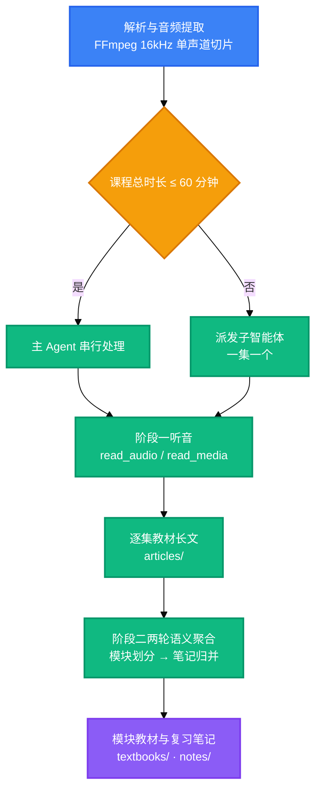

<div align="center">

<a name="readme-top"></a>

<h1>Bili-Video2Book</h1>

<p>
  <strong>把 B 站长视频与本地课程视频批量转换为结构化教材长文与复习笔记。</strong>
  <br />
  <em>两阶段流水线 · 双通道听音 · 三轨交付 · 交付前质检 · Python 3.8+ 纯标准库</em>
</p>

<p>
  <a href="#快速开始"></a>
  <a href="LICENSE"></a>
</p>

<p>
  <a href="https://www.python.org/"></a>
</p>

<p>
  <a href="https://modelcontextprotocol.io/"></a>
  <a href="https://docs.anthropic.com/en/docs/claude-code"></a>
  <a href="https://openai.com/codex/"></a>
  <a href="https://opencode.ai/"></a>
</p>

<p>
  <strong>简体中文</strong> ·
  <a href="README.en.md">English</a>
</p>

</div>

> [!CAUTION]
> 本工具会批量抓取 B 站视频的元数据与音频流，并可保存你的登录凭证。仅用于你自己有权访问的内容，遵守 B 站的服务条款与相关法律规定。`SESSDATA` 等同账号登录态，不要复制、上传或分享。

## 目录

- [核心内容](#核心内容)
- [功能特性](#功能特性)
- [快速开始](#快速开始)
- [基本工作流程](#基本工作流程)
- [使用方法](#使用方法)
- [运行环境与依赖](#运行环境与依赖)
- [配置](#配置)
- [项目结构](#项目结构)
- [命令](#命令)
- [技术栈](#技术栈)
- [安全](#安全)
- [许可证](#许可证)

## 核心内容

一门课程从链接到成书要走过三类产物，工具链围绕它们组织。

### 交付产物

| 能力 | 作用 |
|---|---|
| 单集教材长文 | 一集一篇，由听音结果直接写成的完整长文 |
| 模块教材 | 沿知识边界把多集长文整编为分章教材 |
| 思维导图笔记 | 经两轮语义聚合生成的复习笔记 |

### 听音通道

| 能力 | 作用 |
|---|---|
| `read_audio` | 宿主具备音频模态时直接听音，无需任何凭证 |
| `read_media` | 宿主只有文本能力时改用外挂服务转录，需配置端点 |

## 功能特性

| 特性 | 说明 |
|---|---|
| 一次跑完一门课 | 给出合集链接或本地课程目录，逐集产出长文，再整编为模块教材与复习笔记 |
| 有音频模态就能听 | 宿主能听音时走 `read_audio`，零凭证；只有文本能力时走 `read_media`，两个通道分页契约同构 |
| 三轨产物分目录归档 | 长文落在 `articles/`，模块教材落在 `textbooks/`，笔记落在 `notes/`，可单独取用 |
| 交付前拦停致命项 | 套话填充、空壳标题、分集平铺标题、行内残缺引用、分集口吻命中即判失败；围栏语言标识属提示项，加 `--require-lang` 才纳入门禁 |
| 重跑只补缺失的分集 | 已产出的分集默认跳过，加 `--force` 才会重新处理 |
| 无第三方运行依赖 | 只用 Python 标准库，外部仅依赖系统的 `ffmpeg` |

<div align="right">

[![返回顶部][badge-top]](#readme-top)

</div>

## 快速开始

### 前置条件

```bash
python --version   # 3.8 及以上
ffmpeg -version    # 已加入 PATH
```

### 安装

```bash
# 技能本体：复制这一个目录即可
cp -r skills/bili-video2book ~/.claude/skills/            # Claude Code
cp -r skills/bili-video2book ~/.codex/skills/             # Codex
cp -r skills/bili-video2book ~/.config/opencode/skills/   # OpenCode

# 可选：安装 CLI
pip install -e .

# 听音通道：两个音视频 MCP 服务同属配套仓库 omni-media
cd .. && git clone https://github.com/LINJIANG12/omni-media.git
cd omni-media/mcp && pip install -e .                     # 通道 A：宿主原生听音，零凭证
python -m omni_media_mcp.cli status                       # 诊断依赖与各宿主挂载状态
python -m omni_media_mcp.cli apply --target codex         # 写入该宿主的 MCP 配置
```

### 运行

```bash
bili-video2book pipeline "https://www.bilibili.com/video/BV14VqVBrEhc" --all --article-type learning
```

产物落在 `<产物根>/<课程工作区>/`：长文在 `articles/`，模块教材在 `textbooks/`，笔记在 `notes/`。

<div align="right">

[![返回顶部][badge-top]](#readme-top)

</div>

## 基本工作流程



- 派发阈值写在 `src/core/budget.py`：课程总时长在 60 分钟以内时由主 Agent 串行处理，超过则派发给子智能体，一集一个；集数多且单集短时由工具建议批量打包。
- 阶段一与阶段二解耦（按内容边界切分），较长课程也能在断点后续跑。
- 工具层只产出任务书、派发载荷与门禁，长文与笔记的撰写由 Agent 完成。

<div align="right">

[![返回顶部][badge-top]](#readme-top)

</div>

## 使用方法

### 处理整门课程

```bash
# B 站合集
bili-video2book pipeline "https://www.bilibili.com/video/BV14VqVBrEhc" --all --article-type learning

# 本地课程目录
bili-video2book pipeline "D:\courses\software_engineering\" --all --article-type learning
```

### 处理指定分集或区间

```bash
bili-video2book pipeline "https://www.bilibili.com/video/BV14VqVBrEhc" --page 1 --article-type learning
bili-video2book pipeline "https://www.bilibili.com/video/BV14VqVBrEhc" --range 2-5 --article-type learning
```

### 生成模块教材与复习笔记

```bash
bili-video2book cluster-articles "https://www.bilibili.com/video/BV14VqVBrEhc"
bili-video2book cluster-notes "https://www.bilibili.com/video/BV14VqVBrEhc"
```

### 交付前质检与对账

```bash
python scripts/note_quality_check.py --strict      # 笔记成色
python scripts/render_compat_check.py --strict     # 渲染合规
bili-video2book sync                               # 以磁盘产物回填 manifest.json
```

<div align="right">

[![返回顶部][badge-top]](#readme-top)

</div>

## 运行环境与依赖

| 项目 | 要求 |
|---|---|
| Python | 3.8 及以上，取自 `pyproject.toml` 的 `requires-python` |
| 外部程序 | `ffmpeg`，需加入 `PATH` |
| 听音通道 | `read_audio` 或 `read_media`，二者其一 |
| 操作系统 | 与操作系统无关，见 `pyproject.toml` 的分类器 |

<div align="right">

[![返回顶部][badge-top]](#readme-top)

</div>

## 配置

### 环境变量

| 变量 | 说明 | 默认 | 必需 |
|---|---|---|---|
| `BVB_HOME` | 容器根，`skill/`、`omni-media/`、`output/` 的共同父目录 | 由 `.bvb-home` 标记定位 | 否 |
| `BVB_OUTPUT_DIR` | 产物根 | `<容器根>/output` | 否 |
| `BVB_AUDIO_TOKENS_PER_SEC` | 音频 token 系数；OpenAI 口径设 `100` | `32` | 否 |
| `BVB_CONTEXT_WINDOW_TOKENS` | 上下文窗口预算 | `1000000` | 否 |
| `OMNI_MEDIA_MCP_DIR` | 原生听音服务目录的覆盖 | `<容器根>/omni-media/mcp` | 否 |
| `BVB_DEBUG` | 设为 `1` 时原样抛出栈回溯 | 未设置 | 否 |

环境变量需在进程启动前设置。单次执行也可用 `--base-dir <路径>` 换产物根，命令行参数优先于环境变量。

<div align="right">

[![返回顶部][badge-top]](#readme-top)

</div>

## 项目结构

```
bili-video2book/
├── skills/bili-video2book/     # 技能本体，安装时只需这一个目录
│   ├── SKILL.md                # 技能契约，Agent 的唯一事实源
│   ├── src/                    # 工具链
│   │   ├── cli.py              # 入口：12 个子命令
│   │   ├── core/               # 路径、音频预算、流水线、抓取、交付物质检
│   │   └── generator/          # 任务书、提示词模板与语义聚合
│   ├── scripts/                # 质检、清理、队列跟踪与全量自检
│   └── references/             # 安装说明、交付矩阵、命令速查、工具映射
├── agents/                     # 通用 agents 侧的技能元数据
├── .claude-plugin/             # Claude Code 插件清单
├── .codex-plugin/              # Codex 插件清单
├── .opencode/                  # OpenCode 安装说明
└── pyproject.toml              # 包元数据与 CLI 入口
```

<div align="right">

[![返回顶部][badge-top]](#readme-top)

</div>

## 命令

| 命令 | 说明 | 示例 |
|---|---|---|
| `parse` | 解析视频拓扑并列分集 | `bili-video2book parse "<链接>" --limit 10` |
| `audio` | 下载或抽取音频流 | `bili-video2book audio "<链接>" --all` |
| `transcribe` | 导出单集长文任务书，不落中间逐字稿 | `bili-video2book transcribe "<链接>" --page 1 --article-type learning` |
| `pipeline` | 执行完整流水线 | `bili-video2book pipeline "<链接>" --all --article-type learning` |
| `cluster-articles` | 把单集长文整编为模块教材 | `bili-video2book cluster-articles "<链接>"` |
| `cluster-notes` | 两轮语义聚合，导出笔记任务书 | `bili-video2book cluster-notes "<链接>"` |
| `dedup` | 同步重复音频资产以节省 token | `bili-video2book dedup --dry-run` |
| `cleanup` | 回收已产出的任务书，每类保留样本 | `bili-video2book cleanup --dry-run` |
| `sync` | 以磁盘产物为准回填 manifest.json | `bili-video2book sync --dry-run` |
| `info` | 显示环境与工具链就绪状态 | `bili-video2book info` |
| `login` | 持久化 B 站 SESSDATA | `bili-video2book login --sessdata "<SESSDATA>"` |
| `logout` | 清除已保存的 SESSDATA | `bili-video2book logout` |

### 通用参数

| 参数 | 说明 | 默认 |
|---|---|---|
| `--base-dir` | 产物根路径 | `BVB_OUTPUT_DIR` 或 `<容器根>/output` |
| `--task` | 指定课程工作区目录名 | 最近活动的那个 |
| `--sessdata` | 本次执行的凭证，优先于本地存档 | 已保存的存档 |
| `--json` | 以 JSON 输出，仅 `parse` 与 `audio` | 关 |

### 退出码

| 退出码 | 含义 |
|---|---|
| `0` | 正常结束 |
| `4` | 未确认长文提示词风格，即 `--article-type` 缺失或取值非法 |

<div align="right">

[![返回顶部][badge-top]](#readme-top)

</div>

## 技术栈

### 运行时

| 技术 | 用途 |
|---|---|
| Python 3.8+ | 唯一运行时，仅用标准库 |
| setuptools | 构建后端，见 `pyproject.toml` |

### 外部依赖

| 技术 | 用途 |
|---|---|
| FFmpeg | 音频抽取与切片，16kHz 单声道 |

### 可选通道

| 技术 | 用途 |
|---|---|
| MCP | 宿主原生听音通道的协议 |

<div align="right">

[![返回顶部][badge-top]](#readme-top)

</div>

## 安全

- 凭证存放：`login` 把 B 站 `SESSDATA` 以明文写入产物根，该文件已被忽略规则排除，不会进入版本库。
- 失效方式：怀疑泄露时到 B 站退出登录使该凭证失效，再运行 `logout` 清除本地存档。
- 访问范围：工具只读取 B 站的公开视频元数据与音频流，以及你指定的本地媒体文件。
- 上报渠道：本仓库暂无 `SECURITY.md`，安全问题请在仓库提交 issue。

<div align="right">

[![返回顶部][badge-top]](#readme-top)

</div>

## 许可证

[MIT](LICENSE)

<div align="right">

[![返回顶部][badge-top]](#readme-top)

</div>

<!-- LINKS & IMAGES -->

[badge-top]: https://img.shields.io/badge/-返回顶部-151515?style=flat-square
[badge-python]: https://img.shields.io/badge/Python_3.8%2B-3776AB?style=flat&logo=python&logoColor=white
[badge-mcp]: https://img.shields.io/badge/MCP-3178C6?style=flat
[badge-claude]: https://img.shields.io/badge/Claude_Code-D97757?style=flat&logo=claude&logoColor=white
[badge-codex]: https://img.shields.io/badge/Codex-000000?style=flat&logo=openai&logoColor=white
[badge-opencode]: https://img.shields.io/badge/OpenCode-3178C6?style=flat
[link-python]: https://www.python.org/
[link-mcp]: https://modelcontextprotocol.io/
[link-claude]: https://docs.anthropic.com/en/docs/claude-code
[link-codex]: https://openai.com/codex/
[link-opencode]: https://opencode.ai/
[link-license]: LICENSE
[link-omni-media]: https://github.com/LINJIANG12/omni-media
