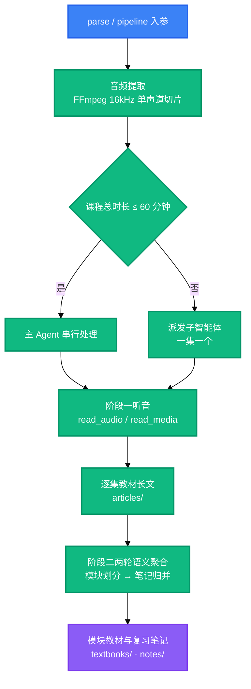

<div align="center">

<a name="readme-top"></a>

<h1>Bili-Video2Book</h1>

<p>
  <strong>把 B 站长视频与本地课程视频批量转换为结构化教材长文与复习笔记。</strong>
  <br />
  <em>两阶段流水线 · 双通道听音 · 三轨交付 · 交付前质检 · Python 3.8+ 纯标准库</em>
</p>

<p>
  <a href="#安装"></a>
  <a href="LICENSE"></a>
</p>

<p>
  <a href="https://www.python.org/"></a>
</p>

<p>
  <a href="https://modelcontextprotocol.io/"></a>
  <a href="https://docs.anthropic.com/en/docs/claude-code"></a>
  <a href="https://openai.com/codex/"></a>
  <a href="https://opencode.ai/"></a>
</p>

<p>
  <strong>简体中文</strong> ·
  <a href="README.en.md">English</a>
</p>

</div>

> [!CAUTION]
> 持久化的 B 站凭证 `SESSDATA` 等同你的账号登录态，以明文保存在产物根。该文件已被忽略规则排除，不会进入版本库。不要复制、上传或分享它；怀疑泄露时到 B 站退出登录使其失效，再运行 `logout` 清除本地存档。

## 功能特性

- 两阶段流水线：阶段一逐集产出教材长文，阶段二按知识边界两轮收敛为模块教材与复习笔记
- 双通道听音：宿主有音频模态时用 `read_audio`，只有文本能力时用 `read_media`，分页契约同构
- 三轨交付：单集长文落在 `articles/`，模块合辑落在 `textbooks/`，思维导图笔记落在 `notes/`
- 交付前质检拦停五类致命项：套话填充、空壳标题、分集平铺标题、行内残缺引用、分集口吻
- 围栏语言标识属提示项，加 `--require-lang` 才纳入门禁
- 零第三方运行依赖：Python 3.8 及以上、纯标准库，外部只依赖系统 `ffmpeg`

## 安装

### 前置依赖

- Python 3.8 或更高版本
- 系统 `ffmpeg` 且已加入 `PATH`
- 听音通道之一：`read_audio` 或 `read_media`

### 安装技能与听音通道

```bash
# 技能本体：复制这一个目录即可，也可直接作为插件安装
cp -r skills/bili-video2book ~/.claude/skills/            # Claude Code
cp -r skills/bili-video2book ~/.codex/skills/             # Codex
cp -r skills/bili-video2book ~/.config/opencode/skills/   # OpenCode

# 可选：安装 CLI
pip install -e .

# 听音通道：两个音视频 MCP 服务同属配套仓库 omni-media
cd .. && git clone https://github.com/LINJIANG12/omni-media.git
cd omni-media/mcp && pip install -e .                     # 通道 A：宿主原生听音，零凭证
python -m omni_media_mcp.cli status                       # 诊断依赖与各宿主挂载状态
python -m omni_media_mcp.cli apply --target codex         # 写入该宿主的 MCP 配置（或用 opencode/all）

# 通道 B：宿主只有文本能力时改用它，需先填 config.json
cd ../mcp-ext && pip install -e .
python -m omni_media_ext.cli config --init
python -m omni_media_ext.cli apply --target codex
```

### 环境变量

| 变量 | 说明 | 默认 | 必需 |
|---|---|---|---|
| `BVB_HOME` | 容器根，`skill/`、`omni-media/`、`output/` 的共同父目录 | 由 `.bvb-home` 标记定位 | 否 |
| `BVB_OUTPUT_DIR` | 产物根 | `<容器根>/output` | 否 |
| `BVB_AUDIO_TOKENS_PER_SEC` | 音频 token 系数；OpenAI 口径设 `100` | `32` | 否 |
| `BVB_CONTEXT_WINDOW_TOKENS` | 上下文窗口预算 | `1000000` | 否 |
| `OMNI_MEDIA_MCP_DIR` | 原生听音服务目录的覆盖 | `<容器根>/omni-media/mcp` | 否 |
| `BVB_DEBUG` | 设为 `1` 时原样抛出栈回溯 | 未设置 | 否 |

环境变量需在进程启动前设置。单次执行也可用 `--base-dir <路径>` 换产物根。

### 验证

```bash
cd skills/bili-video2book
python src/cli.py info        # 打印 Python、ffmpeg、ffprobe、两条听音通道与域路径
python scripts/selfcheck.py   # 全量契约自检，退出码 0 表示全部通过
```

## 使用方法

### 处理整门课程

```bash
# B 站合集
bili-video2book pipeline "https://www.bilibili.com/video/BV14VqVBrEhc" --all --article-type learning

# 本地课程目录
bili-video2book pipeline "D:\courses\software_engineering\" --all --article-type learning
```

### 处理指定分集或区间

```bash
bili-video2book pipeline "https://www.bilibili.com/video/BV14VqVBrEhc" --page 1 --article-type learning
bili-video2book pipeline "https://www.bilibili.com/video/BV14VqVBrEhc" --range 2-5 --article-type learning
```

### 生成模块教材与复习笔记

```bash
bili-video2book cluster-articles "https://www.bilibili.com/video/BV14VqVBrEhc"
bili-video2book cluster-notes "https://www.bilibili.com/video/BV14VqVBrEhc"
```

### 交付前质检与对账

```bash
python scripts/note_quality_check.py --strict      # 笔记成色
python scripts/render_compat_check.py --strict     # 渲染合规
bili-video2book sync                               # 以磁盘产物回填 manifest.json
```

## 命令

| 命令 | 说明 | 示例 |
|---|---|---|
| `parse` | 解析视频拓扑并列分集 | `bili-video2book parse "<链接>" --limit 10` |
| `audio` | 下载或抽取音频流 | `bili-video2book audio "<链接>" --all` |
| `transcribe` | 导出单集长文任务书，不落中间逐字稿 | `bili-video2book transcribe "<链接>" --page 1 --article-type learning` |
| `pipeline` | 执行完整流水线 | `bili-video2book pipeline "<链接>" --all --article-type learning` |
| `cluster-articles` | 把单集长文整编为模块教材 | `bili-video2book cluster-articles "<链接>"` |
| `cluster-notes` | 两轮语义聚合，导出笔记任务书 | `bili-video2book cluster-notes "<链接>"` |
| `dedup` | 同步重复音频资产以节省 token | `bili-video2book dedup --dry-run` |
| `cleanup` | 回收已产出的任务书，每类保留样本 | `bili-video2book cleanup --dry-run` |
| `sync` | 以磁盘产物为准回填 manifest.json | `bili-video2book sync --dry-run` |
| `info` | 显示环境与工具链就绪状态 | `bili-video2book info` |
| `login` | 持久化 B 站 SESSDATA | `bili-video2book login --sessdata "<SESSDATA>"` |
| `logout` | 清除已保存的 SESSDATA | `bili-video2book logout` |

### 通用参数

| 参数 | 说明 | 默认 |
|---|---|---|
| `--base-dir` | 产物根路径 | `BVB_OUTPUT_DIR` 或 `<容器根>/output` |
| `--task` | 指定课程工作区目录名 | 最近活动的那个 |
| `--sessdata` | 本次执行的 B 站凭证，优先级高于本地存档 | 已保存的存档 |
| `--json` | 以 JSON 输出，仅 `parse` 与 `audio` | 关 |

### 退出码

| 退出码 | 含义 |
|---|---|
| `0` | 正常结束 |
| `4` | 未确认长文提示词风格，即 `--article-type` 缺失或取值非法 |

## 工作流程



派发阈值见 `src/core/budget.py`：课程总时长在 60 分钟以内时由主 Agent 串行处理，超过则派发给子智能体，一集一个；集数多且单集短时由工具建议批量打包。阶段一的逐集产出与阶段二的两轮规划都由 Agent 完成，工具层只提供任务书、派发载荷与门禁。

## 许可证

[MIT](LICENSE)

<div align="right">

[![返回顶部][badge-top]](#readme-top)

</div>

<!-- LINKS & IMAGES -->

[badge-top]: https://img.shields.io/badge/-返回顶部-151515?style=flat-square

[badge-python]: https://img.shields.io/badge/Python_3.8%2B-3776AB?style=flat&logo=python&logoColor=white
[badge-mcp]: https://img.shields.io/badge/MCP-111827?style=flat
[badge-claude]: https://img.shields.io/badge/Claude_Code-D97757?style=flat&logo=claude&logoColor=white
[badge-codex]: https://img.shields.io/badge/Codex-000000?style=flat&logo=openai&logoColor=white
[badge-opencode]: https://img.shields.io/badge/OpenCode-4B5563?style=flat
[badge-cta-install]: https://img.shields.io/badge/安装-4CAF50?style=for-the-badge
[badge-cta-license]: https://img.shields.io/badge/许可证-MIT-yellow?style=for-the-badge
[link-python]: https://www.python.org/
[link-mcp]: https://modelcontextprotocol.io/
[link-claude]: https://docs.anthropic.com/en/docs/claude-code
[link-codex]: https://openai.com/codex/
[link-opencode]: https://opencode.ai/
[link-license]: LICENSE
[link-omni-media]: https://github.com/LINJIANG12/omni-media
