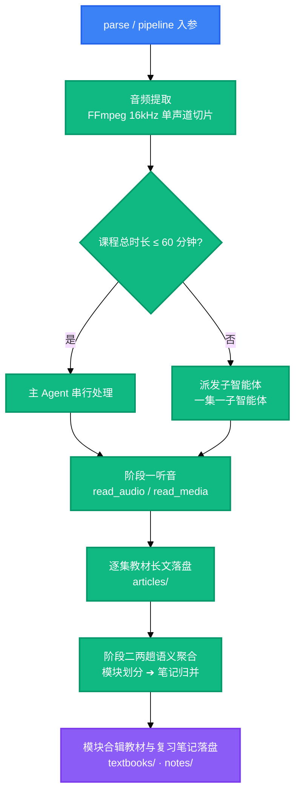

<!-- BEAUTIFIED -->
<h1 align="center">Bili-Video2Book</h1>

<p align="center">
  <strong>把 B 站长视频与系列网课重构为结构化教材长文、模块合辑全书与思维导图复习笔记。</strong>
  <br />
  <em>两阶段解耦流水线 · 双通道听音 · 三轨结构化交付 · 交付前质检门禁 · 零第三方运行依赖</em>
</p>

<p align="center">
  <a href="#快速开始"></a>
  <a href="LICENSE"></a>
</p>

<p align="center">
  
  
  
</p>

<p align="center">
  <a href="https://docs.anthropic.com/en/docs/claude-code"></a>
  <a href="https://openai.com/codex/"></a>
  <a href="https://opencode.ai"></a>
</p>

<p align="center">
  中文 · <a href="README.en.md">English</a>
</p>

---

## 功能特性

| 能力 | 说明 |
| :--- | :--- |
| **两阶段解耦流水线** | 阶段一逐集产出教材长文，阶段二按知识边界两趟收敛：先划模块，再归并成笔记。规划由 Agent 产出，缺失或越界时工具当场抢救后继续，命令始终正常退出。 |
| **双通道听音** | 有原生音频模态的宿主用 `read_audio`，零凭证且延迟更低；只有文本能力的宿主用 `read_media`，由外部模型代读。两条通道分页契约同构，切换只需换工具名。 |
| **三轨结构化交付** | 同时输出单集教材长文（`articles/`）、模块合辑教材（`textbooks/`）与思维导图复习笔记（`notes/`），分别对应深入自学、系统通读与考前速记。 |
| **交付前质检门禁** | 五类致命项直接拦停：套话填充、空壳标题、分集平铺标题、行内残缺引用、分集口吻。围栏语言标识属提示项，加 `--require-lang` 才纳入门禁。 |
| **零第三方运行依赖** | 工具链是 Python 3.8+ 纯标准库实现，不下载模型权重、不占用本地显存。唯一的外部依赖是系统 `ffmpeg`。 |
| **产物与代码分离** | 三域布局把技能、音视频 MCP 服务与产物彼此隔开。产物不会进入任何 `git status`，删除或迁移仓库都不影响成品。 |

---

## 快速开始

### 前置依赖

- Python 3.8 或更高版本；
- 系统 `ffmpeg` 且已加入 `PATH`，这是取音频与切片的硬前置；
- 听音通道之一：`read_audio` 或 `read_media`，见下一步；
- 宿主支持 Agent Skills 规范，例如 Claude Code、Codex 或 OpenCode。

### 安装

```bash
# 1) 听音通道：两个音视频 MCP 服务同属配套仓库
cd .. && git clone https://github.com/LINJIANG12/omni-media.git   # 容器布局里已存在则跳过

cd omni-media/mcp && pip install -e .                     # 通道 A：宿主原生听音，零凭证
python -m omni_media_mcp.cli status                       # 诊断依赖与各宿主挂载状态
python -m omni_media_mcp.cli apply --target codex         # 写入该宿主的 MCP 配置（也可用 opencode/all）

# 通道 B：宿主只有文本能力时改用它（需先填 config.json）
cd ../mcp-ext && pip install -e .
python -m omni_media_ext.cli config --init                # 生成 config.json，填入端点与 api_key
python -m omni_media_ext.cli status --probe               # 环境 + 配置 + 端点可达性 + 该挂哪一个
python -m omni_media_ext.cli apply --target codex

# 2) 技能本身：把 skills/bili-video2book/ 这一个目录复制或软链到本平台技能目录；
#    也可直接作为插件安装，本仓库已备好各平台声明（见 references/install.md）
```

### 验证

```bash
cd skills/bili-video2book
python src/cli.py info        # 查看 Python / ffmpeg / ffprobe / 两条听音通道 / 三域路径
python scripts/selfcheck.py   # 全量契约自检，应全部通过
```

### 运行

```bash
# --article-type 必填；不传即 exit 4
bili-video2book pipeline "https://www.bilibili.com/video/BV14VqVBrEhc" --all --article-type learning
```

> 命令与工作目录已解耦：`--base-dir` 缺省即产物根（绝对路径），因此在任意目录执行都能找到同一批工作区。

---

## 使用

以下为最常见的四种用法。按任务目标划分的**完整六个场景**（含 CLI 参数与收尾流程）见
[`references/cli-cookbook.md`](skills/bili-video2book/references/cli-cookbook.md)。

### 处理整门课程

```bash
# B 站网课合集
bili-video2book pipeline "https://www.bilibili.com/video/BV14VqVBrEhc" --all --article-type learning

# 本地整套视频课程目录
bili-video2book pipeline "D:\courses\software_engineering\" --all --article-type learning
```

### 只处理指定分集或区间

```bash
bili-video2book pipeline "https://www.bilibili.com/video/BV14VqVBrEhc" --page 1 --article-type learning
bili-video2book pipeline "https://www.bilibili.com/video/BV14VqVBrEhc" --range 2-5 --article-type learning
```

### 生成模块合辑教材与复习笔记

```bash
# 阶段一单集长文就绪后，整编生成模块教材
bili-video2book cluster-articles "https://www.bilibili.com/video/BV14VqVBrEhc"

# 复习笔记只有一种风格，无需 --style；两趟规划都由 Agent 产出
bili-video2book cluster-notes "https://www.bilibili.com/video/BV14VqVBrEhc"
```

### 交付前质检与账本对账

```bash
python scripts/note_quality_check.py --strict     # 笔记成色体检
python scripts/render_compat_check.py --strict    # 渲染合规体检
python src/cli.py sync                            # 以磁盘产物为唯一真相回填 manifest.json
```

---

## 架构



阶段一的逐集产出与阶段二的两趟规划都由 Agent 完成，工具层只负责提供任务书、派发载荷与门禁。
派发阈值集中在 `src/core/budget.py`：课程总时长在 **60 分钟**以内时可由主 Agent 串行处理；
超过则**派发**给子智能体，一集一个，集数多且单集短时由工具建议批量打包，避免单次上下文被音频挤爆。

交付前质检与账本对账是流水线之外的独立入口，由操作者在交付前自行执行，见
[`references/cli-cookbook.md`](skills/bili-video2book/references/cli-cookbook.md) 场景六。

---

## 配置

### 环境变量

| 变量 | 说明 | 默认 |
| :--- | :--- | :--- |
| `BVB_HOME` | 容器根（`skill/`、`omni-media/`、`output/` 的共同父目录） | 由 `.bvb-home` 标记自动定位 |
| `BVB_OUTPUT_DIR` | 产物根 | `<容器根>/output` |
| `BVB_AUDIO_TOKENS_PER_SEC` | 音频 token 系数，按宿主实测口径设置 | `32` |
| `BVB_CONTEXT_WINDOW_TOKENS` | 宿主上下文窗口预算 | `1000000` |
| `OMNI_MEDIA_MCP_DIR` | 原生听音服务目录的显式覆盖 | `<容器根>/omni-media/mcp` |
| `BVB_DEBUG` | 设为 `1` 时环境类错误原样抛出栈回溯，便于排查 | 未设置 |

环境变量须在进程启动前设置。临时换位置也可用 `--base-dir <路径>`。

### 凭证

处理 B 站合集任务时可提供 `SESSDATA` 登录凭证，以降低触发 412 频控的概率；本地音视频任务不需要。
两种配置方式、脱敏指纹查看与安全须知见 `SKILL.md` §2。

### 运行期状态文件

| 文件 | 位置 | 说明 |
| :--- | :--- | :--- |
| `.sessdata.json` | 产物根 | 持久化的 B 站凭证，已被忽略规则排除，不入库 |
| `.wbi_keys.json` | 产物根 | WBI 签名密钥缓存 |
| `.cli_status.json` | 产物根 | 上次 412 与熔断状态 |

---

## 项目结构

```text
skill/                                  # 本仓库：插件 / 分发单元
├── skills/bili-video2book/             # ★ 技能安装单元，装这一个目录即可
│   ├── SKILL.md                        # 技能定义，唯一真源
│   ├── references/                     # 安装对照、工具名映射、交付矩阵、CLI 场景手册
│   ├── scripts/                        # 自检、队列追踪、质检与清理入口
│   └── src/                            # 工具链实现：CLI、生成器、核心
├── .codex-plugin/  .claude-plugin/     # 平台插件声明
├── .agents/plugins/  .opencode/        # 通用 agents 与 OpenCode 声明
├── AGENTS.md  CLAUDE.md                # 各 agent 自动加载的入口
├── README.md  README.en.md
└── pyproject.toml                      # 可选：pip install -e . 暴露 CLI

<容器根>/                                # 三域布局，本仓库只是其中一域
├── skill/                              # 技能仓库，即本仓库
├── omni-media/                         # 配套仓库：两个音视频 MCP 服务
└── output/                             # 产物根：每门课一个工作区
```

---

## 技术栈

### 运行时

| 技术 | 用途 |
| :--- | :--- |
| Python 3.8+ | 工具链实现，仅使用标准库 |
| FFmpeg | 提取 16 kHz 单声道人声切片，并探测媒体规格 |

### 协议与集成

| 技术 | 用途 |
| :--- | :--- |
| MCP | 与听音服务通信（`read_audio` / `read_media`），分页契约由 `OMNI_STATUS` 注释承载 |
| Agent Skills 规范 | 技能分发与跨宿主加载，支持 Claude Code、Codex、OpenCode 等 |

---

## 贡献

1. Fork 本仓库；
2. 创建特性分支：`git checkout -b feature/<name>`；
3. 提交改动：`git commit -m 'feat: ...'`；
4. 推送分支并开启 Pull Request。

提交前请在技能目录执行自检，它是本仓库唯一的门禁：

```bash
cd skills/bili-video2book && python scripts/selfcheck.py
```

改动需遵守 `CLAUDE.md` 列出的硬约束：纯标准库、Python 3.8 语法、子进程统一走
`src/core/proc.py` 且必须带硬超时、技能正文只描述行动语义而不写死宿主私有工具名、
平台差异只放在 `references/host-tools/`。

---

## 许可证

[MIT](LICENSE)
